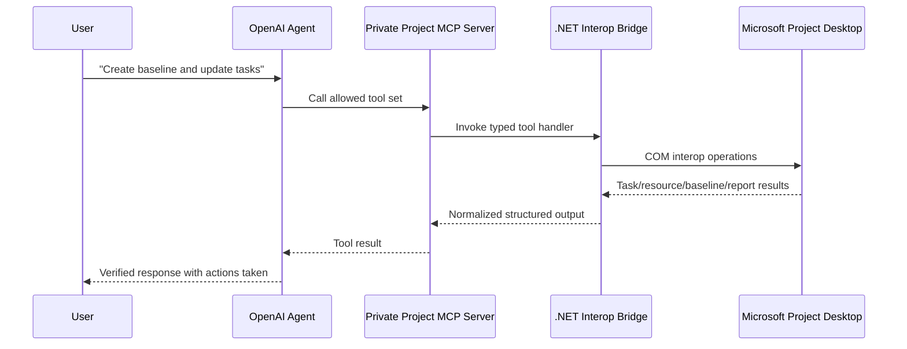
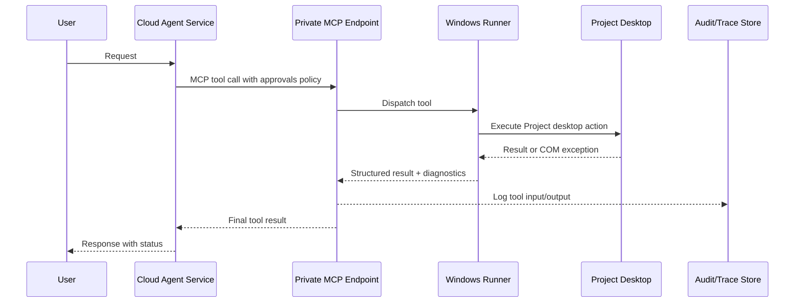

# Building a Microsoft Project MCP Agent Across Desktop Versions

## Executive summary

If your goal is an **OpenAI-powered agent that can call tools against Microsoft Project desktop across Microsoft 365 subscription, Project Professional 2024/2021/2019, and Project Standard 2024/2021/2019**, the strongest default choice is a **.NET bridge** running on **Windows** and automating the **desktop Project COM object model** through **Microsoft.Office.Interop.MSProject**. It is the best combination of version compatibility, feature coverage, long-term maintainability, typed error handling, and official tooling. Microsoft’s Project desktop automation surface is fundamentally COM-based, and the .NET interop layer is the most robust managed wrapper around that object model. Microsoft also provides VSTO templates for Project add-ins and documents Project interop and VSTO architecture explicitly. citeturn9search0turn10search6turn10search17turn10search0

The clear **second choice** is a **Python bridge** using **pywin32** or **comtypes** on Windows. It can automate nearly the same Project desktop features because it still talks to the same COM object model, and it is excellent for fast prototyping, data transformation, and local agent experimentation. The tradeoff is weaker typing, more brittle packaging, and lower performance than early-bound .NET interop. Microsoft’s own Project automation guidance notes that late-bound scripting clients are comparatively weaker in performance than early-bound clients. citeturn36search0turn36search5turn1search4turn9search3

A **raw COM bridge** is still viable for maximum native fidelity, especially from VBA, VBScript, PowerShell, or C++, but it is no longer the best engineering default for a modern agentic system. It gives you the full object model, but you lose much of the structure, testing ergonomics, and deployment discipline that .NET adds on top. citeturn1search4turn9search3

A **Node.js bridge** is the weakest primary choice **for full Project automation**. Node is excellent for the **agent orchestration layer** because OpenAI’s official JavaScript SDK and Agents SDK are strong, but Node is not the best place to host the **Project automation layer** itself. If you implement Node via **Office.js task pane add-ins**, the Project API surface is officially limited: there is no Project-specific JavaScript API, the Common API is limited, and complex data queries or deep schedule/report automation require alternatives outside the Office JavaScript API. If you implement Node via a community COM wrapper like **winax**, it is technically possible, but the result is still a Windows-only native-addon path with a smaller ecosystem than .NET or Python. citeturn27view1turn29search2turn41view0turn36search3

The most practical production architecture is therefore:

1. **OpenAI Responses API or Agents SDK** as the agent layer.
2. A **private MCP server** hosted on a **Windows desktop or Windows VM** that has the correct Project SKU installed and activated.
3. A **.NET Project bridge** inside that MCP server exposing a **small, opinionated tool set** such as `open_project`, `list_tasks`, `upsert_task`, `assign_resource`, `save_baseline`, `set_timeline`, `list_custom_reports`, and `export_pdf`. OpenAI’s MCP tooling supports both hosted remote MCP servers and runtime-managed local/private MCP connections, can restrict imported tools with `allowed_tools`, and defaults MCP calls to approval flows for safety. citeturn31view2turn31view0turn31view1turn32view1

One major strategic caveat matters in 2026: **Project 2019 is already out of support**, **Project 2021 retires on October 13, 2026**, **Project Online retires on September 30, 2026**, and **Project for the web retired on August 1, 2025 with capabilities moving into Planner**. That means a new integration intended to live for several years should prefer **Project 2024** and/or **Microsoft 365 subscription desktop** for desktop automation, while any cloud-first roadmap should target **Planner premium / Dataverse / Project schedule APIs** rather than legacy Project Online patterns. citeturn14search1turn14search0turn41view0turn39view1turn39view2

## Version and product landscape

The most important thing to understand is that your target list mixes **desktop Project SKUs** with **subscription/cloud services**. The desktop application family remains the anchor for deep automation. Microsoft documents that **Microsoft 365**, **Office LTSC 2024**, **Office LTSC 2021**, **Office 2021**, and **Office 2019** all share **version 16.0** and use **Click-to-Run** in modern supported deployment scenarios; Microsoft also notes that add-ins and extensibility solutions compatible with Office LTSC 2021 or Office 2019 are likely to work with Office LTSC 2024 with minimal testing. Microsoft further shows supported coexistence scenarios where Microsoft 365 Apps can be installed alongside **Project Standard 2024 retail**, **Project Standard 2021 retail**, **Project Professional 2019 volume licensed**, and similar 16.0 Click-to-Run combinations, provided version, bitness, and update-channel rules are respected. citeturn16view0turn15view0

For the exact product identifiers relevant to retail deployment, Microsoft’s Office Deployment Tool documentation lists **`ProjectPro2024Retail`**, **`ProjectStd2024Retail`**, **`ProjectPro2021Retail`**, **`ProjectStd2021Retail`**, and the earlier generic retail identifiers **`ProjectProRetail`** and **`ProjectStdRetail`**, which are the relevant 2019-era retail identifiers in current deployment guidance. citeturn18view0turn18view1turn18view2turn18view3turn17search0

The main functional divide is not 2019 vs 2021 vs 2024 in the object model so much as **Standard vs Professional vs subscription/cloud-connected services**. Microsoft’s current comparison states that **Project Standard 2024** includes local scheduling, task and cost management, calendar/Gantt/network/task sheet views, baselines, milestones, critical path, and resource leveling. **Project Professional 2024** includes everything in Standard plus more comprehensive resource management, timesheets, and the ability to connect to **Project Server Subscription Edition**. The subscription offering **Planner and Project Plan 3** includes **Project desktop** and **Project Online**. citeturn13view0turn12search12turn12search10

The lifecycle picture is now a decisive architectural factor:

| Product family | Status on June 11, 2026 | Key implications for a new MCP agent |
|---|---|---|
| Microsoft 365 subscription desktop / Project Online desktop client | Current subscription client; only subscription versions receive regular feature updates. Project Online service is retiring September 30, 2026. citeturn16view0turn41view0 | Good for desktop automation today, but avoid building new dependencies on legacy Project Online service endpoints. |
| Project Professional 2024 / Standard 2024 | Supported through October 9, 2029. Click-to-Run 16.0. citeturn14search5turn16view0 | Best perpetual-license target for a multi-year desktop automation build. |
| Project Professional 2021 / Standard 2021 | Retires October 13, 2026. Click-to-Run 16.0. citeturn14search0turn16view0 | Works technically, but new production investment is hard to justify with retirement so close. |
| Project Professional 2019 / Standard 2019 | Support ended October 14, 2025. Click-to-Run 16.0 in supported coexistence guidance. citeturn14search1turn16view0 | Only support as a legacy-compatibility target; do not design your primary deployment around it. |

There is also a cloud-platform split that matters for “Microsoft 365” planning. Microsoft states that **Project for the web retired on August 1, 2025**, that most of its capabilities continue in **Planner**, and that Project for the web data lived in **Microsoft Dataverse**. Separate Microsoft documentation for Project schedule APIs shows a Dataverse-based scheduling surface that can create, update, and delete projects, tasks, dependencies, resource assignments, buckets, team members, checklists, and labels. That is a viable cloud-native path, but it is **not the Project desktop COM model**. citeturn39view1turn39view2

## Bridge comparison

### Detailed comparison table

| Bridge option | Compatibility with listed Project desktop versions | Feature coverage in Project desktop | Authentication and licensing fit | Deployment fit | Stability and maintenance | Ecosystem and samples | Overall assessment |
|---|---|---|---|---|---|---|---|
| **.NET bridge** | Best. Project desktop automation is exposed through `Microsoft.Office.Interop.MSProject`; VSTO add-ins are officially supported for Project; 16.0 Click-to-Run continuity makes 2019/2021/2024-era compatibility relatively stable, though lifecycle varies. citeturn9search0turn10search6turn15view0turn16view0 | Highest. Full COM object model access for projects, tasks, resources, assignments, baselines, timeline operations, custom reports, and visual reports. Tasks, resources, assignments, baseline save, and timeline APIs are all documented. citeturn3search0turn3search1turn35search0turn3search2turn5search0turn3search3turn34search0 | Aligns well with retail, perpetual, and subscription desktop licensing because it automates the installed desktop app. Professional/subscription is needed for server-connected scenarios like Project Server / legacy Project Online. citeturn13view0turn12search10turn20search0 | Best for **desktop add-in**, **local sidecar**, or **private Windows worker**. Less suitable as pure server automation because Office unattended automation is “AS IS” and risky. citeturn10search17turn21search0 | Best long-term choice: strong typing, COM interop wrappers, mature Visual Studio tooling, better early-binding performance. citeturn9search14turn9search7turn1search4turn9search3 | Strong official ecosystem: Interop docs, VSTO templates, Project VBA/object model docs, OpenAI .NET SDK. citeturn10search0turn5search2turn30view0 | **Recommended default** |
| **Python bridge** | Good, because it still drives the same Windows COM automation surface via `pywin32` or `comtypes`. Windows-only. citeturn36search0turn36search5 | Near-full for desktop automation, assuming COM access and adequate wrapper code. Same Project object model underneath as .NET/COM. citeturn3search0turn3search1turn35search0turn3search2turn5search0turn3search3 | Same desktop licensing realities as .NET. Best in attended/local scenarios; unattended licensing interpretation needs care. citeturn20search0turn22view0turn21search0 | Best for **local sidecar**, **data-science-heavy worker**, or **prototype MCP server** on Windows. Not ideal for enterprise desktop add-in UX. | Faster to prototype, but weaker typing and packaging. Microsoft notes late-bound scripting clients are comparatively poorer in performance than early-bound clients. citeturn1search4turn9search3 | Good practical ecosystem: `pywin32`, `comtypes`, OpenAI Python SDK, HostedMCPTool examples in the Agents SDK docs. citeturn36search0turn36search5turn27view2turn32view1 | **Recommended second choice** |
| **COM bridge** | Excellent technical compatibility with desktop Project itself because this is the native automation layer. citeturn1search4turn9search0 | Full Project desktop automation potential. Same object model as .NET/Python. citeturn3search0turn3search1turn35search0turn3search2turn5search0turn3search3 | Same licensing model as any desktop automation path. | Works for **VBA**, **VBScript**, **PowerShell**, or native/C++ clients. Poor fit for modern agent engineering compared with .NET. | Lower-level, more fragile, less ergonomic testing and deployment. Late binding is flexible but weaker for maintainability and performance than early binding. citeturn9search3turn1search4 | Native Office automation model is very well documented, but modern agent samples are thinner. | **Good specialist option, not the default** |
| **Node.js bridge** | Mixed. As an **Office.js add-in**, Project support is official but limited; Project Professional supports task pane add-ins, Project Standard supports them with more limited capabilities. As a **COM wrapper** via `winax`, it is technically possible but community-driven. citeturn41view0turn36search3 | Weak for full Project feature automation if you stay in Office.js: no Project-specific JS API, limited Common API, limited data query capabilities, and complex schedule/report scenarios require alternatives. Better only if Node orchestrates and a different bridge does the Project automation. citeturn7search0turn41view0 | Same desktop licensing if Node talks to local Project via COM. If Office.js only, you still need supported Project desktop SKUs. | Best for **agent orchestration**, **web UI**, or **task pane add-in UI**. Not best for the core Project automation engine. | OpenAI’s JS stack is excellent, but Project-native automation in Node is not. Community COM wrappers add native-addon complexity. | Official OpenAI JS SDK and Agents SDK are strong; Project Office.js docs exist; COM wrappers like `winax` exist but are not Microsoft-native. citeturn27view1turn29search2turn36search3 | **Use Node above the bridge, not as the bridge** |

### What this means in practice

The reason **.NET** comes out first is simple: the deepest Microsoft Project automation capabilities still live in the **desktop COM object model**, and the best-supported way to consume that model from modern application code is **.NET interop**. Microsoft documents the `Microsoft.Office.Interop.MSProject` assembly, Project VSTO support, and Project’s automation model directly. The same stack can also expose a clean MCP surface to OpenAI. citeturn9search0turn10search6turn10search17turn30view0

The reason **Python** comes out second is equally simple: it inherits nearly all of that capability because it still talks to COM, but it does so through scripting-friendly wrappers rather than through a strongly typed managed interop layer. That makes it great for a fast bridge, especially if your tooling around the agent, ETL, or analytics is already Python-heavy. citeturn36search0turn36search5turn27view2

The reason **Node.js** ranks lower is not that JavaScript is weak for agents. It is strong for agents. It ranks lower because **Project automation** and **Project add-in capabilities** are not strongest there. Microsoft explicitly says Project add-ins use the Common API, that there is no Project-specific JavaScript API, and that the support is limited compared with other Office hosts. Microsoft also notes that the Common API for Project is primarily about task/resource/view selection and basic field data, not full schedule manipulation, deep reporting, or comprehensive data integration. citeturn7search0turn41view0

## Recommended architectures

### Recommended architecture for broad desktop compatibility

When the requirement is “one agent, many Project desktop versions, full feature coverage,” the most durable design is a **private Windows Project worker** with a **.NET MCP server**.



This architecture is the best fit because it preserves the full desktop object model, keeps the Project-specific complexity behind a narrow tool interface, and maps cleanly onto OpenAI’s MCP tooling. OpenAI’s Responses API can import tools from a remote MCP server, restrict them with `allowed_tools`, and require approval by default. That lets you expose only the Project operations you actually trust the model to call. citeturn31view2turn31view0turn31view1

This design is also the safest answer to the version spread in your brief. All of your listed Project desktop generations sit on the modern 16.0 family, but their **support status** differs sharply. A private worker lets you standardize the bridge code while certifying it against **2024**, **current subscription**, and any legacy compatibility targets you still need. citeturn16view0turn14search5turn14search0turn14search1

### Recommended architecture for cloud orchestration with private Windows execution

If you want the agent itself in the cloud, but Microsoft Project automation must still happen against local desktop software, use a **hybrid split**: cloud orchestration plus a **private Windows runner**. Do **not** assume generic unattended Office server automation is equivalent to a normal web service. Microsoft’s unattended Office automation guidance is explicit that such usage is “AS IS” and requires careful testing; it is not the same reliability model as a normal server API. citeturn21search0



This is the architecture to use when you need central control, auditability, or connections to other systems, but your Project actions still require a licensed Windows desktop environment. It also positions you to migrate some tools later from desktop automation toward cloud APIs where available, such as Dataverse-backed schedule APIs for Planner premium / former Project for the web scenarios. citeturn31view1turn39view2turn38search3

### Why I am not recommending Project Office.js as the primary path

Project **task pane add-ins** are real and supported. Microsoft says **Project Professional** supports them, and **Project Standard** supports them with more limited capabilities. But Microsoft also says there is **no Project-specific JavaScript API**, that the Common API support is limited, and that advanced data integration scenarios previously enabled by ProjectData OData are no longer available through the Office JavaScript API. This means an Office.js task pane is good as **UI or lightweight context integration**, not as the primary automation backbone for your feature set. citeturn41view0

There is another important desktop-UX nuance: Microsoft’s VSTO feature matrix shows **Project supports VSTO add-ins**, but **custom task panes are not available for Project VSTO add-ins**, while Ribbon customizations are. So if you want **full automation**, .NET/VSTO is excellent, but your in-app UI is more likely to be Ribbon-driven or an external desktop pane/window. If you specifically want an in-app web task pane, Office.js can provide that, but with a much smaller Project API surface. citeturn11view0

## OpenAI integration and implementation sketches

OpenAI’s current guidance is straightforward: use the **Responses API** when one model call plus tools and your own application logic is enough, and use the **Agents SDK** when your application needs first-class orchestration, approvals, state, tracing, handoffs, and more sophisticated runtime control. OpenAI’s SDK and quickstart docs also show official support for **JavaScript**, **Python**, and **.NET**, and the MCP tooling works through the Responses API with both remote MCP servers and connectors. citeturn26view0turn29search8turn30view0turn31view2

That leads to a practical ranking for your use case:

| OpenAI approach | Best use in a Microsoft Project MCP build |
|---|---|
| **Responses API + MCP tool** | Best default for a straightforward Project tool-calling agent. It is the canonical OpenAI surface for remote MCP servers and connectors. citeturn26view2turn31view2 |
| **Agents SDK** | Best when you want multi-step orchestration, guarded approvals, tracing, or runtime-managed local/private MCP connections. The official SDK guidance is centered on TypeScript and Python. citeturn26view0turn32view1turn29search2 |
| **Official OpenAI libraries** | Use the language-native SDK for whichever layer hosts the agent. OpenAI documents official JS, Python, and .NET quickstarts. citeturn27view1turn27view2turn30view0 |
| **openai CLI** | Best for smoke tests, CI checks, one-off terminal workflows, scripted validation, and debugging MCP tool behavior—not as the production orchestration runtime. citeturn26view3turn27view0 |

### .NET bridge sketch

The bridge-side code below illustrates the **Project automation layer**. It uses the documented Project interop assembly and the same task/resource/baseline APIs Microsoft exposes in VBA and interop documentation. citeturn9search0turn3search0turn3search1turn35search0turn3search2

```csharp
// Windows-side Project MCP tool handler (conceptual)
using MSProject = Microsoft.Office.Interop.MSProject;

public sealed class ProjectBridge
{
    public object CreateTaskAndBaseline(string mppPath, string taskName, string resourceName)
    {
        var app = new MSProject.Application();
        app.Visible = false;

        try
        {
            app.FileOpenEx(Name: mppPath, ReadOnly: false);

            MSProject.Project pj = app.ActiveProject;

            // Create task
            MSProject.Task task = pj.Tasks.Add(taskName);

            // Create resource
            MSProject.Resource resource = pj.Resources.Add(resourceName);

            // Assign resource to task
            pj.Assignments.Add(TaskID: task.ID, ResourceID: resource.ID, Units: 1);

            // Save baseline
            app.BaselineSave(All: true);

            pj.Save();
            return new
            {
                ok = true,
                taskId = task.ID,
                resourceId = resource.ID,
                projectName = pj.Name
            };
        }
        finally
        {
            app.FileCloseAllEx();
            app.Quit();
        }
    }
}
```

On the **agent side**, OpenAI’s .NET quickstart and MCP examples show the current pattern: call the Responses API, add an MCP tool, and optionally constrain tool scope. citeturn30view0turn31view0

```csharp
// Agent-side call into a private Project MCP server (conceptual)
using OpenAI.Responses;

string key = Environment.GetEnvironmentVariable("OPENAI_API_KEY")!;
OpenAIResponseClient client = new(model: "gpt-5.5", apiKey: key);

ResponseCreationOptions options = new();
options.Tools.Add(ResponseTool.CreateMcpTool(
    serverLabel: "project-mcp",
    serverUri: new Uri("https://project-mcp.internal/sse"),
    allowedTools: new McpToolFilter() { ToolNames = { "open_project", "create_task", "save_baseline" } }
));

OpenAIResponse response = (OpenAIResponse)client.CreateResponse(
[
    ResponseItem.CreateUserMessageItem([
        ResponseContentPart.CreateInputTextPart(
            "Open C:\\Plans\\Roadmap.mpp, create task 'API hardening', assign 'Alex', then save baseline."
        )
    ])
], options);

Console.WriteLine(response.GetOutputText());
```

### Python bridge sketch

This is the best “fast path” implementation if you want to prove the agent and tool design quickly on Windows. The bridge still relies on the documented Project desktop COM model, but Python keeps the worker compact. OpenAI’s Python SDK and MCP docs make the agent side straightforward. citeturn36search0turn36search5turn27view2turn31view0

```python
# Windows-side Project MCP tool handler (conceptual)
import win32com.client

def create_task(mpp_path: str, task_name: str, resource_name: str) -> dict:
    app = win32com.client.Dispatch("MSProject.Application")
    app.Visible = False
    try:
        app.FileOpenEx(Name=mpp_path, ReadOnly=False)
        pj = app.ActiveProject

        task = pj.Tasks.Add(task_name)
        resource = pj.Resources.Add(resource_name)
        pj.Assignments.Add(TaskID=task.ID, ResourceID=resource.ID, Units=1)

        app.BaselineSave(True)
        pj.Save()

        return {
            "ok": True,
            "project": pj.Name,
            "task_id": task.ID,
            "resource_id": resource.ID,
        }
    finally:
        app.FileCloseAllEx()
        app.Quit()
```

The corresponding Python agent call can use the OpenAI Responses API directly with an MCP tool configuration and an explicit tool allowlist, which OpenAI documents as the recommended way to constrain MCP cost and latency. citeturn27view2turn31view0turn31view2

```python
from openai import OpenAI

client = OpenAI()

resp = client.responses.create(
    model="gpt-5.5",
    tools=[{
        "type": "mcp",
        "server_label": "project-mcp",
        "server_url": "https://project-mcp.internal/sse",
        "require_approval": "never",   # keep "always" while validating in production
        "allowed_tools": ["open_project", "create_task", "save_baseline"]
    }],
    input=(
        "Open C:\\Plans\\Roadmap.mpp, create task 'API hardening', "
        "assign 'Alex', and save the project baseline."
    )
)

print(resp.output_text)
```

### Integration steps that fit this report’s recommendation

Start by building **Project tools first**, not a giant agent. Define a narrow contract: open a project, read tasks, create/update tasks, create resources, assign resources, save a baseline, manipulate the timeline, list custom reports, and export a summary artifact. That maps cleanly to the official Project object model. citeturn3search0turn3search1turn35search0turn3search2turn5search0turn3search3

Then attach that tool surface to the **Responses API** as an MCP server. Use `allowed_tools` aggressively because OpenAI warns that large MCP tool inventories increase cost and latency. Keep approvals enabled until you are confident in the data paths and domain logic. OpenAI explicitly recommends reviewing and logging what data is being shared with MCP servers. citeturn31view0turn31view1turn31view2

When you outgrow a single request/response loop—because you need retries, preflight validation, approvals, audit traces, specialist subagents, or mixed local/private MCP topologies—move that exact same tool surface behind the **Agents SDK**. OpenAI’s integrations guidance distinguishes between **hosted MCP** for public remote servers and **runtime-owned local/private MCP** when your runtime should own the connection and trust boundary. For a Project desktop bridge, that latter model is often the better trust fit. citeturn32view1turn32view2

## Deployment checklist

A production deployment should pass all of the following checks before you let the agent perform write operations:

- **Windows only** for the Project desktop bridge, with the correct supported OS and supported Office/Project environment. Office LTSC 2024 documentation and Project installation guidance both assume Windows desktop deployment for Project desktop. citeturn15view0turn23search0
- **Correct Project SKU installed and activated** on the worker, using the correct retail/subscription account or deployment product ID. Retail Project Standard/Professional requires product-key redemption and account linkage; subscription desktop requires the corresponding assigned subscription. citeturn20search0turn12search10turn18view0
- **Matched bitness across coinstalled Office/Project products**. Microsoft explicitly says all installed products on the same computer must match 32/64-bit version. citeturn16view0
- **Matched update channel and install technology** if coinstalling Office, Project, or Visio. Microsoft documents that products installed together must use compatible versioning, update channels, and installation technologies. citeturn16view0
- **No assumption of generic server-style unattended automation**. Microsoft’s Office unattended automation guidance says this configuration is “AS IS” and needs thorough testing. If you must automate without a signed-in end user, treat it as a dedicated Windows runner scenario with explicit licensing review. citeturn21search0turn22view1
- **Subscription shared desktop review** for Microsoft 365/Project desktop pools. Microsoft explicitly says shared computer activation can also be used with the subscription versions of the Project and Visio desktop apps when the underlying plan includes those products. citeturn22view0
- **Tool allowlists and approvals**. OpenAI recommends `allowed_tools`, notes MCP calls default to approvals, and recommends logging data shared with MCP servers. citeturn31view0turn31view1
- **Project-specific UX decision**: if you need deep automation, use .NET/VSTO/sidecar; if you need an in-app web task pane, use Office.js but accept a smaller Project API surface. Microsoft’s feature matrix and Project add-in docs make this tradeoff explicit. citeturn11view0turn41view0

## Migration and compatibility notes

The version story is stable enough for one bridge codebase, but the **support story is not**. Microsoft’s own lifecycle pages make **Project 2019** a legacy-only target now, and **Project 2021** is about to retire in October 2026. For anything net new, the real desktop targets should be **Project 2024** and **current Microsoft 365 subscription desktop**. citeturn14search1turn14search0turn14search5

The medium-term cloud story is shifting away from legacy Project Online and old add-in patterns. Microsoft’s current Project add-in documentation says **Project Online is retiring on September 30, 2026**, and that **Project Server Subscription Edition** removed integration features such as the **ProjectData OData service**. In parallel, Microsoft’s Project for the web service description says **Project for the web retired on August 1, 2025** and that its data model is/was built on **Dataverse**, which aligns with the documented Dataverse-based schedule APIs. So if your roadmap eventually needs a **cloud-first** Microsoft “Projects” agent, build your desktop MCP bridge now, but expect a second lane that targets **Planner premium / Dataverse / schedule APIs** rather than old Project Online endpoints. citeturn41view0turn39view1turn39view2

There are a few compatibility positives worth keeping in view. Microsoft says the modern Office/Project family shares **version 16.0**, supported coexistence scenarios exist across Microsoft 365 plus Project 2024/2021/2019 Click-to-Run installations, and solutions compatible with 2021 or 2019 are likely to work with LTSC 2024 with minimal testing. Microsoft also states that Project plans from earlier versions can be used in Project 2024 and that Project 2021, 2019, 2016, 2013, and 2010 share the same file format. That is good news for migration of your agent’s file-handling logic. citeturn16view0turn15view0turn13view0

### Open questions and limitations

The main unresolved point in the official material reviewed is **Project-specific unattended licensing language**. Microsoft is clear about unattended RPA for **Microsoft 365 Apps for enterprise**, and clear that subscription versions of the **Project and Visio desktop apps** can use shared computer activation, but the reviewed sources do not provide equally explicit Project-only unattended licensing detail. That makes unattended Project execution a topic to validate with Microsoft or your licensing reseller before large-scale rollout. citeturn22view0turn22view1

A second nuance is that **Node.js** can be made to work against COM via community wrappers, but the reviewed official Microsoft sources mainly speak to **Office.js Project add-ins**, not to Node-as-COM-host. For that reason, the report’s low ranking of Node is high-confidence for **primary Project automation**, but less categorical if your real design is **Node for orchestration + .NET for Project execution**. citeturn41view0turn36search3

## Prioritized official sources

The most important Microsoft and OpenAI documents for this build are these:

- **Microsoft Project service description** for the current product split between Project for the web, Project Online, and the Project Online desktop client. citeturn39view0
- **Supported scenarios for installing different versions of Office, Project, and Visio** for the 16.0 / Click-to-Run / bitness / update-channel rules. citeturn16view0
- **Project lifecycle pages** for 2019, 2021, and 2024 support horizons. citeturn14search1turn14search0turn14search5
- **Microsoft 365 Project pricing/comparison page** for Standard vs Professional feature differences and current perpetual-vs-subscription posture. citeturn13view0
- **Project add-ins documentation** for the limits of Office.js in Project and the 2026 retirement note for Project Online. citeturn41view0
- **Project VBA / object model references** for task creation, resource creation, assignments, timeline manipulation, baselines, custom reports, and visual reports. citeturn3search0turn3search1turn35search0turn3search2turn5search0turn3search3turn34search0
- **VSTO Project documentation and feature matrix** for .NET add-in support and the custom-task-pane limitation in Project VSTO. citeturn10search6turn10search17turn11view0
- **OpenAI Agents SDK guide**, **SDKs and CLI**, **developer quickstart**, and **MCP and Connectors** guide for the current agent, SDK, and MCP integration patterns. citeturn26view0turn26view1turn30view0turn26view2turn31view0turn32view1

The strongest recommendation, based on the current Microsoft and OpenAI platform state, is:

**Build the Project automation layer in .NET on Windows, expose it as a private MCP server with a small approved tool surface, use the OpenAI Responses API first, and graduate to the Agents SDK only when you need richer orchestration. Keep Python as the fast secondary bridge, and use Node.js above the bridge—not as the primary Project desktop bridge itself.** citeturn9search0turn10search6turn26view0turn31view2turn32view2