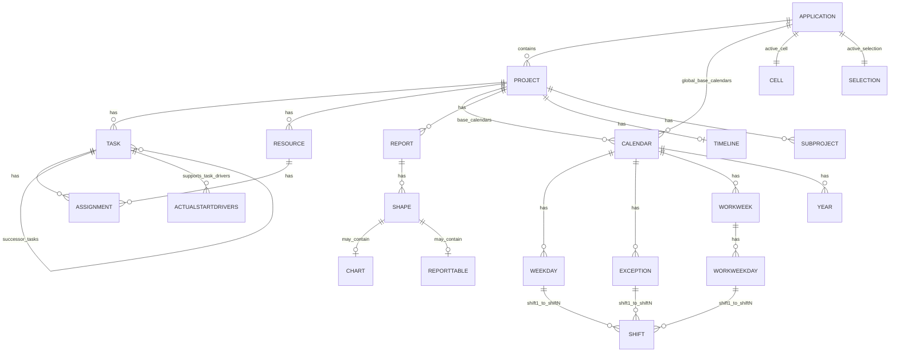
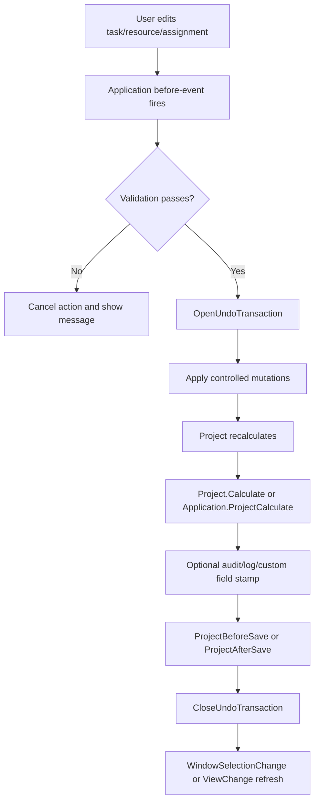

# Microsoft Project Desktop VBA and COM Deep Research Report

## Executive summary

Microsoft Project desktop automation is built on a classic COM and VBA object model whose top-level control point is the `Application` object. `Application` owns global state, exposes UI-facing objects such as `ActiveProject`, `ActiveCell`, and `ActiveSelection`, and provides hundreds of command-like methods that mirror major desktop actions such as opening files, changing views, applying groups and filters, saving baselines, formatting Gantt bars, exporting PDFs, manipulating the Timeline, and working with enterprise projects. Each open file is represented by a `Project` object in the `Projects` collection, and each `Project` exposes its own `Tasks`, `Resources`, `BaseCalendars`, `Reports`, `Views`, `Timeline`, `Subprojects`, tables, filters, and groups. citeturn32view0turn33view0turn34view0

For desktop automation, the practical architecture is best understood as two layers. The first is an object layer: `Project` → `Tasks`/`Resources`/`BaseCalendars`/`Reports`/`Timeline`. The second is a command layer: `Application` methods that perform the same kinds of actions a user performs in the ribbon, dialog boxes, and context menus. This duality is why Project VBA feels different from Excel: many operations are available both as object/property edits and as UI-like commands such as `LinkTasks`, `FilterEdit`, `ViewApply`, `GroupApply`, `GanttBarFormat`, `TaskOnTimeline`, `VisualReports`, and `DocumentExport`. citeturn32view0turn8search0turn8search1turn8search2turn8search10turn10search1turn6search3turn30search1

The object maps Microsoft publishes are the right “source of truth” for relationships. `Calendars` can hang from `Application` or `Project`; `Resources` can hang from `Project`, `Task`, or `Selection`; `Tasks` can hang from `Project`, `Selection`, or another `Task` through predecessor/successor relationships. `Assignment` is the bridge object between `Task` and `Resource`, and Project’s Task Drivers features surface collections such as `ActualStartDrivers` and `CalendarDrivers` to explain why dates are where they are. citeturn35search1turn34view2turn34view1turn37search3turn37search2turn37search10

The event model is split between application-level events and project-level events. `Application` exposes a broad set of before/after and window-selection events such as `ProjectBeforeTaskChange2`, `ProjectBeforeAssignmentNew2`, `ProjectBeforeSave2`, `WindowSelectionChange`, `WindowViewChange`, and `OnUndoOrRedo`. `Project` exposes a simpler lifecycle set such as `Open`, `Activate`, `BeforeSave`, `Calculate`, `Change`, and `BeforeClose`. For robust automation, event code should be centralized, re-entrancy guarded, and paired with undo transactions using `OpenUndoTransaction` and `CloseUndoTransaction`. citeturn32view0turn33view0turn26search0turn26search1turn31search0

For integration, Project desktop VBA remains strong for recorder-assisted, client-side automation and cross-Office COM scripting. Microsoft’s own guidance still positions VBA as suitable for macros and relatively simple automation, while recommending Visual Studio and the Project interop assemblies for more complex, secure, and scalable desktop solutions. If the target extends beyond the desktop client into Project Server or Project Online, the client object model is only part of the picture; broader enterprise automation uses Project Server APIs such as CSOM, REST, and, for on-premises server integration, PSI. citeturn27search10turn24search0turn24search2turn24search4turn24search6turn24search17

Security and deployment are now a first-class concern. Macro settings live in each Office app’s Trust Center, macros from the internet are blocked by default, Microsoft recommends “disable all except digitally signed macros” plus requiring trusted publishers for users who must run VBA, and signed projects should be maintained with current signature practices. Trusted Documents, Trusted Publishers, and Trusted Locations matter operationally for Project deployments just as much as for the rest of Office. citeturn23search2turn23search3turn23search4turn23search5turn23search11turn23search14

## Object model architecture and maps

The official Project object model starts at `Application`, whose responsibilities are broader than “the current file.” It includes application-wide settings, top-level UI objects, and methods that act upon views, selections, editing actions, and system-wide commands. The `Projects` collection contains the set of open projects, and each `Project` object represents one open plan. `Project` then fans out into the objects most schedule automations care about: `Tasks`, `Resources`, `Calendar`, `BaseCalendars`, `Reports`, `Views`, `Timeline`, `Subprojects`, task/resource tables, task/resource filters, and task/resource groups. citeturn32view0turn33view0turn34view0

Microsoft’s published object maps are especially useful because they show *where collections can legally appear*. `Calendars` can be returned from `Application.GlobalBaseCalendars` and `Project.BaseCalendars`; `Resources` can be a child of `Project`, `Task`, or `Selection`; and `Tasks` can be a child of `Project`, `Selection`, or another `Task`, including predecessor and successor task collections. That matters when writing generalized macros, because the same collection type can have different parents and therefore different automation context. citeturn35search1turn34view2turn34view1

At the calendar layer, a `Calendar` belongs to the `Calendars` collection and exposes `WeekDays`, `Exceptions`, `WorkWeeks`, and `Years`; the current project calendar is returned by `Project.Calendar`, while a resource calendar is accessed through `Resource.Calendar`. At the resource layer, `Resource` objects expose `Assignments`, `Availabilities`, `BaseCalendar`, and timephased methods such as `TimeScaleData`. At the task layer, `Task` objects expose `Assignments`, predecessor/successor linking methods, outline methods, timephased methods, and field accessors. `Assignment` is the join point between task and resource data. citeturn36view0turn17search5turn17search13turn16search0turn16search4turn37search3turn37search11

A practical relational view of the Project desktop model is below.



This diagram is a faithful simplification of the official object maps and object pages: `Application`/`Projects`, the `Calendars` map, the `Resources` map, the `Tasks` map, the `Calendar` object, the `Assignment` object, the report object family, and Task Drivers via `ActualStartDrivers`. citeturn34view0turn35search1turn34view2turn34view1turn36view0turn37search3turn9search3turn28search12turn29search0turn37search2

### Key object map takeaways

The most important practical mapping rules are these:

| Concept | Canonical object-model path | Why it matters |
|---|---|---|
| Current desktop session | `Application` | Owns global state, active selection/cell, command-like methods, and application-level events. citeturn32view0 |
| Open plan set | `Application.Projects` | Enables multi-project automation and consolidation. citeturn34view0turn33view0 |
| Current plan | `Application.ActiveProject` or `Project` reference | Standard root for task/resource/calendar work. citeturn32view0turn33view0 |
| Tasks | `Project.Tasks`, `Selection.Tasks`, `Task.PredecessorTasks`, `Task.SuccessorTasks` | Same collection type appears in several contexts. citeturn34view1turn15search2 |
| Resources | `Project.Resources`, `Task.Resources`, `Selection.Resources` | Resource-centric macros should not assume a single parent path. citeturn34view2turn15search1 |
| Calendars | `Application.GlobalBaseCalendars`, `Project.BaseCalendars`, `Project.Calendar`, `Resource.Calendar` | Distinguishes template/global calendars from project and resource calendars. citeturn35search1turn17search5turn17search13 |
| Task ↔ resource join | `Assignment` / `Assignments` | All work/cost/loading automation ultimately passes through assignment data. citeturn37search0turn37search3turn37search11 |
| Reports | `Project.Reports` → `Report.Shapes` → `Chart`/`ReportTable` | Reporting automation uses Office Art-style shape objects, not table/view objects. citeturn9search3turn29search15turn29search0turn28search12turn28search6 |
| Timeline | `Project.Timeline` plus `Application.TaskOnTimeline` / `TimelineExport` | Timeline automation is partly object-based and partly command-based. citeturn10search4turn10search1turn10search2 |

## UI feature mapping

The most useful way to map the desktop UI to VBA is not “button to button,” but **feature to canonical object/procedure**. In Project, many ribbon and dialog actions are exposed as `Application` methods, while direct record access goes through `Project`, `Task`, `Resource`, `Assignment`, `Calendar`, `Report`, and related objects. citeturn32view0turn33view0

### File, selection, and schedule-editing mapping

| UI feature | Primary object | Member(s) to automate | Typical VBA pattern | Source |
|---|---|---|---|---|
| Create a new plan | `Application` | `FileNew` | `Application.FileNew` | citeturn32view0 |
| Open a local file or import data | `Application` | `FileOpenEx` | `Application.FileOpenEx Name:="C:\Plan.mpp"` | citeturn6search0 |
| Save the active plan | `Application` | `FileSave` | `Application.FileSave` | citeturn32view0 |
| Save as another format or export data | `Application` | `FileSaveAs` | `Application.FileSaveAs Name:="Plan.xml"` | citeturn6search1 |
| Open/check out a Project Server plan | `Application` | `FileOpenEx`, `CheckOut`, `CheckIn`, `Publish` | `FileOpenEx Name:="<>\Project1"` then publish/check in | citeturn6search0turn11search5 |
| Inspect the active cell | `Application`, `Cell` | `ActiveCell`, `Cell.Task`, `Cell.Resource` | `Set t = ActiveCell.Task` | citeturn14search0turn14search2turn14search3turn15search3 |
| Inspect selected tasks/resources | `Application`, `Selection` | `ActiveSelection`, `Selection.Tasks` | `For Each t In ActiveSelection.Tasks` | citeturn15search0turn15search1turn15search2 |
| Move focus to a field/cell | `Application` | `SetActiveCell`, `SelectTaskField` | Use command methods rather than `SendKeys` | citeturn11search5turn14search4 |
| Add a task | `Project`, `Tasks` | `Project.Tasks.Add` | `ActiveProject.Tasks.Add "New Task"` | citeturn16search4 |
| Edit a task field | `Task` | `SetField`, `GetField` | `t.SetField fieldId, value` | citeturn22search1turn22search5 |
| Link selected tasks | `Application` | `LinkTasks` | Select rows, then `Application.LinkTasks` | citeturn12search7 |
| Link a task to predecessors/successors directly | `Task` | `LinkPredecessors`, `LinkSuccessors` | Object-level linking inside loops | citeturn16search4 |
| Unlink selected tasks | `Application` | `UnlinkTasks` | `Application.UnlinkTasks` | citeturn13search1 |
| Remove a task constraint | `Application` | `ClearConstraint` | `Application.ClearConstraint taskId` | citeturn13search0 |
| Save a baseline | `Application` | `BaselineSave` | `Application.BaselineSave All:=True` | citeturn12search0 |
| Clear a baseline | `Application` | `BaselineClear` | `Application.BaselineClear All:=True` | citeturn12search13 |
| Set the project status date | `Application` | `ChangeStatusDate` | `Application.ChangeStatusDate #6/30/2026#` | citeturn12search2 |
| Use Task Drivers explanation | `Task`, `ActualStartDrivers`, `CalendarDrivers` | Driver collections | Read driver counts/items to explain start dates | citeturn37search2turn37search10 |

### Resources, assignments, calendars, and load-balancing mapping

| UI feature | Primary object | Member(s) to automate | Typical VBA pattern | Source |
|---|---|---|---|---|
| Add a resource | `Project`, `Resources` | `Resources.Add` | `ActiveProject.Resources.Add "Electrician"` | citeturn16search0 |
| Read or set resource custom fields | `Resource` | `GetField`, `SetField` | `r.SetField fieldId, "A"` | citeturn22search2turn22search3 |
| Create an assignment | `Assignments` | `Assignments.Add` | `ActiveProject.Assignments.Add TaskID:=1, ResourceID:=2, Units:=1` | citeturn37search11 |
| Browse assignments on a task | `Task`, `Assignments` | `Task.Assignments` | `For Each a In t.Assignments` | citeturn37search0turn37search3 |
| Browse assignments on a resource | `Resource`, `Assignments` | `Resource.Assignments` | Resource-centric loading reports | citeturn16search0turn37search3 |
| Level one resource | `Resource` | `Level` | `r.Level` | citeturn13search7 |
| Level the whole plan or selected work | `Application`, `Project` | `LevelNow`, `LevelSelected`, `LevelingOptions`, `LevelingClear` | Use command methods for UI-like leveling | citeturn32view0 |
| Navigate to the next overallocation | `Application` | `GotoNextOverAllocation` | `Application.GotoNextOverAllocation` | citeturn13search6 |
| Get the current project calendar | `Project` | `Calendar` | `Set cal = ActiveProject.Calendar` | citeturn17search5 |
| Work with base calendars | `Project`, `Calendars`, `Calendar` | `BaseCalendars`, `BaseCalendarCreate`, `Calendar.Reset` | Create or reset reusable calendars | citeturn34view3turn36view0 |
| Edit weekdays and working time | `Calendar`, `WeekDays`, `WeekDay`, `Shift` | `WeekDays(index)`, `Shift1..ShiftN` | Update shift start/finish times programmatically | citeturn36view0turn19search1turn19search7turn18search2turn18search6 |
| Maintain calendar exceptions | `Calendar`, `Exceptions`, `Exception` | `Calendar.Exceptions`, `Exceptions.Add`, `Exception.Delete` | Add holidays or shutdown windows | citeturn17search9turn19search2 |
| Use work-week definitions | `Calendar`, `WorkWeeks`, `WorkWeek` | `Calendar.WorkWeeks` | Special seasonal or phased work patterns | citeturn36view0turn19search3 |
| Assign a task calendar | `Task` | `Task.Calendar` | `t.Calendar = "Night Shift"` or `"None"` | citeturn17search15 |
| Assign a resource calendar | `Resource` | `Resource.Calendar` | Not meaningful for material resources | citeturn17search13 |

### Views, formatting, reports, timeline, import/export, and events mapping

| UI feature | Primary object | Member(s) to automate | Typical VBA pattern | Source |
|---|---|---|---|---|
| Apply a view | `Application` | `ViewApply` | `Application.ViewApply "Gantt Chart"` | citeturn8search0 |
| Create/edit a table | `Application` | `TableEdit`, `TableApply` | Build or reuse custom tables | citeturn8search2turn11search5 |
| Create/edit/apply a filter | `Application` | `FilterEdit`, `FilterApply`, `FilterClear` | Build reusable filters in code | citeturn8search1turn11search5 |
| Apply or clear a group | `Application` | `GroupApply`, `GroupClear` | Group task/resource views programmatically | citeturn9search4turn11search5 |
| Format a Gantt bar | `Application` | `GanttBarFormat` | Override default bar formatting | citeturn8search10 |
| Edit Gantt bar styles | `Application` | `GanttBarStyleEdit`, `GanttBarStyleBaseline`, `GanttBarStyleCritical` | Change global/default bar styling | citeturn9search4turn32view0 |
| Edit gridlines | `Application` | `GridlinesEdit` | Cosmetic alignment with corporate templates | citeturn9search4 |
| Open a visual report wizard | `Application` | `VisualReports` | `Application.VisualReports pjTabTaskUsage` | citeturn6search3 |
| Add a custom report | `Reports`, `Report` | `Reports.Add` | `Set rpt = ActiveProject.Reports.Add("Status")` | citeturn28search0turn9search3 |
| Add a chart or report table | `Shapes`, `Shape` | `Shapes.AddChart`, `Shapes.AddTable` | Bound to report canvas, not view tables | citeturn29search0turn28search12turn28search6 |
| Show the report field list | `Application` | `ShowReportDataPane` | Equivalent to Show/Hide Field List on chart/table context menu | citeturn28search8 |
| Copy report as image | `Application` | `CopyReport` | Paste into Word, Excel, PowerPoint | citeturn10search17 |
| Add/remove tasks on timeline | `Application`, `Timeline` | `TaskOnTimeline` | `Application.TaskOnTimeline TaskID:=id` | citeturn10search1turn10search4 |
| Export timeline to clipboard | `Application` | `TimelineExport` | Copy active timeline as image | citeturn10search2 |
| Export current plan to PDF/XPS | `Application` or `Project` | `DocumentExport`, `ExportAsFixedFormat` | Durable distribution output | citeturn30search1turn33view0 |
| Create/edit import-export maps | `Application` | `MapEdit` | Excel/CSV XML map definition and reuse | citeturn6search2 |
| Open XML content directly | `Application` | `OpenXML` | Best for valid Project XML strings; XML files can also be opened with `FileOpenEx` | citeturn30search2turn30search16 |
| Macro-record gaps in reports | `Report`, `Shape`, `Chart` | Object model only; recorder incomplete | Add/edit report elements with VBA, not recorder output | citeturn27search0turn28search3turn29search1 |
| Handle desktop lifecycle and edits | `Application`, `Project` | App/project events | Validation, audit, policy enforcement, refresh | citeturn32view0turn33view0turn3search0 |

## Enumerations and field mapping

The Project VBA reference exposes a very large enumeration catalog. The list you supplied spans scheduling, assignment, timescale, Gantt/report formatting, import/export, server interaction, custom fields, UI/view types, and security-related options. In practice, the enums that matter most are the ones that appear repeatedly in method signatures and field access patterns. The densest and most operational enum family is `PjField`: it is the constant system behind `GetField`, `SetField`, `FieldNameToFieldConstant`, and `FieldConstantToFieldName`, and it is the bridge between human field names and the numeric identifiers needed by generic field APIs. citeturn21search3turn22search0turn22search1turn22search2turn22search3turn22search5

### The enum families that matter most in real automation

| Enum family | What it controls in practice | Common touchpoints |
|---|---|---|
| `PjField` | Built-in and custom field constants for task/resource/project fields | `FieldNameToFieldConstant`, `FieldConstantToFieldName`, `Task.GetField`, `Task.SetField`, `Resource.GetField`, `Resource.SetField`. citeturn21search3turn22search0turn22search1turn22search2turn22search3turn22search5 |
| `PjCustomField`, `PjCustomFieldType`, `PjCustomFieldAttribute`, `PjSummaryCalc`, `PjValueListItem` | Custom field creation, renaming, formulas, lookup/value lists, rollups | `CustomFieldRename`, `CustomFieldSetFormula`, `CustomFieldValueList`, `CustomFieldValueListAdd`. citeturn20search2turn21search0turn21search1turn21search2 |
| `PjFileFormat`, `PjDocExportType`, `PjImportMethods`, `PjDataCategories`, `PjTextFileOrigin` | Save/export/import format choice and map behavior | `FileSaveAs`, `DocumentExport`, `MapEdit`, `FileOpenEx`. citeturn6search1turn30search1turn6search2turn6search0 |
| `PjVisualReportsTab`, `PjVisualReportsTemplateType`, `PjReportLayoutTemplateId` | Visual Reports and report layout commands | `VisualReports`, report automation. citeturn6search3turn32view0 |
| `PjBarShape`, `PjBarType`, `PjBarEndShape`, `PjBarSize`, `PjColor`, `PjGridline`, `PjCalendarShading` | Gantt and calendar formatting | `GanttBarFormat`, `GanttBarStyleEdit`, `GridlinesEdit`, calendar layout methods. citeturn8search10turn9search4turn32view0 |
| `PjAuthentication`, `PjAccountType`, `PjPublishScope`, `PjCheckOutType`, `PjServerPage` | Account/server/publish operations for enterprise scenarios | `CreateWebAccount`, `Publish`, `CheckOut`, `OpenServerPage`. citeturn11search5turn24search6turn24search17 |
| `PjTimescaledData`, `PjTaskTimescaledData`, `PjResourceTimescaledData`, `PjAssignmentTimescaledData`, `PjTimescaleUnit` | Timephased data extraction and detail styles | `TimeScaleData`, detail style/timescale features. citeturn16search0turn16search4turn9search4 |

### Prioritizing the long enum list you supplied

From your list, the highest-value enums for daily desktop automation are these:

- **Scheduling logic:** `PjConstraint`, `PjTaskFixedType`, `PjTaskLinkType`, `PjCalculation`, `PjPriority`, `PjWorkContourType`, `PjNewTasksStartOnDate`, `PjScheduleProjectFrom`, `PjSaveBaselineFrom`, `PjSaveBaselineTo`.
- **Resources and assignments:** `PjResourceTypes`, `PjAssignmentField`, `PjAssignmentUnits`, `PjResourceWarnings`, `PjTaskWarnings`, `PjOverallocationType`, `PjResAssignOperation`.
- **Views and formatting:** `PjViewType`, `PjFilterViewType`, `PjGridline`, `PjDateFormat`, `PjColor`, `PjLegend`, `PjThemeElement`, `PjTeamPlannerStyle`.
- **Import/export and reporting:** `PjFileFormat`, `PjDocExportType`, `PjImportMethods`, `PjDataCategories`, `PjDataTemplate`, `PjVisualReportsTab`, `PjVisualReportsTemplateType`, `PjVisualReportsCubeType`.
- **Server and enterprise:** `PjAuthentication`, `PjCheckOutType`, `PjPublishScope`, `PjProjectType`, `PjProjectUpdate`, `PjServerPage`, `PjServerVersionInfo`.

Those are the enums most likely to appear in production macros because they align with field access, task/resource changes, report/export operations, and Project Server integration points visible in the official method set. citeturn32view0turn6search0turn6search1turn6search2turn6search3turn30search1turn24search6turn24search17

### Field constant mapping patterns

The fundamental pattern is:

1. Convert a human-friendly field name to a field constant with `FieldNameToFieldConstant`.
2. Use `GetField`/`SetField` on `Task`, `Resource`, or other objects that expose those generic methods.
3. Convert back to a display name with `FieldConstantToFieldName` when you need logs, diagnostics, or dynamic UI. citeturn21search3turn22search0turn22search1turn22search2turn22search3turn22search5

**Example: local custom task field**

```vb
Sub ReadWriteLocalTaskField()
    Dim t As Task
    Dim fieldId As Long
    Dim fieldName As String
    
    Set t = ActiveProject.Tasks(1)
    fieldId = pjTaskText1                 ' PjField constant
    fieldName = FieldConstantToFieldName(fieldId)
    
    Debug.Print fieldName & ": " & t.GetField(fieldId)
    t.SetField fieldId, "Needs review"
End Sub
```

**Example: enterprise field by name**

```vb
Sub ReadWriteEnterpriseField()
    Dim fieldId As Long
    Dim displayName As String
    
    fieldId = FieldNameToFieldConstant("TestEntProjText", pjProject)
    displayName = FieldConstantToFieldName(fieldId)
    
    Debug.Print displayName & ": " & ActiveProject.ProjectSummaryTask.GetField(fieldId)
    ActiveProject.ProjectSummaryTask.SetField fieldId, "Approved"
End Sub
```

**Example: resource custom field**

```vb
Sub MarkResourceBand()
    Dim r As Resource
    Dim fieldId As Long
    
    Set r = ActiveProject.Resources(1)
    fieldId = pjResourceText1
    r.SetField fieldId, "Band A"
    
    Debug.Print r.Name & " -> " & r.GetField(fieldId)
End Sub
```

These patterns are directly backed by Microsoft’s field mapping and field access APIs. `FieldNameToFieldConstant` returns the numeric identifier for local or enterprise custom fields; `FieldConstantToFieldName` reverses that; `Task.GetField`/`Task.SetField` and `Resource.GetField`/`Resource.SetField` perform the actual read/write. Enterprise project fields are often accessed through `ProjectSummaryTask` when opened from Project Server. citeturn21search3turn22search0turn22search1turn22search2turn22search3turn22search5turn22search6

## Event model and governance

Microsoft documents two major event scopes for the Project desktop client. The `Application` event surface is broad and operational: project before/after events, task/resource/assignment before-change events, save/publish hooks, selection/view/window events, server job notifications, and undo/redo notifications. The `Project` object has a smaller lifecycle surface: `Open`, `Activate`, `BeforeSave`, `Calculate`, `Change`, `BeforeClose`, and related events. Together, these support policy enforcement, data-quality gates, audit logging, automatic formatting, and refresh workflows. citeturn32view0turn33view0turn3search0

### Recommended event-governance pattern

The safest production pattern is:

- trap **validation** in `ProjectBefore...` events where the action can still be cancelled;
- trap **observation/logging** in after events or project `Change`/`Calculate`;
- use a **module- or class-level re-entrancy flag** so your own updates do not recursively fire the same event handlers;
- bracket multi-step write operations inside `OpenUndoTransaction` / `CloseUndoTransaction`;
- never register application-level events from another Office host before setting `Application.Visible = True`, because child objects can be unavailable until the Project UI is visible. citeturn26search0turn26search1turn31search0turn32view0

### Event-driven automation flow



This is the architecture Microsoft’s event surface supports: before-events for validation, calculate/save events for post-processing, and undo transactions for user-friendly rollback semantics. citeturn32view0turn33view0turn26search0turn26search1

### Sample event-driven macros

The following patterns are anchored in the official Application/Project event sets and the “using events” guidance. citeturn3search0turn32view0turn33view0

**Central application event sink in a class module**

```vb
' Class module name: CAppEvents
Option Explicit

Public WithEvents App As Application
Private mBusy As Boolean

Private Sub App_ProjectBeforeTaskChange2(ByVal tsk As Task, ByVal Field As PjField, _
    ByVal NewVal As Variant, ByRef Cancel As Boolean)
    
    If mBusy Then Exit Sub
    
    ' Example policy: block blank task names
    If Field = pjTaskName Then
        If Trim$(CStr(NewVal)) = "" Then
            Cancel = True
            MsgBox "Task Name cannot be blank.", vbExclamation
        End If
    End If
End Sub

Private Sub App_ProjectBeforeSave2(ByVal pj As Project, ByVal SaveAsUi As Boolean, _
    ByRef Cancel As Boolean)
    
    If mBusy Then Exit Sub
    
    ' Example policy: require a status date before save
    If pj.StatusDate = "NA" Or pj.StatusDate = "" Then
        Cancel = True
        MsgBox "Set a Status Date before saving.", vbExclamation
    End If
End Sub

Private Sub App_WindowSelectionChange(ByVal Window As Window, ByVal sel As Selection)
    ' Example observer hook
    Debug.Print "Selection changed in view."
End Sub
```

**Bootstrap events from `ThisProject` or a standard module**

```vb
Option Explicit
Public gAppEvents As CAppEvents

Sub StartEventHandlers()
    Set gAppEvents = New CAppEvents
    Set gAppEvents.App = Application
End Sub

Sub StopEventHandlers()
    Set gAppEvents = Nothing
End Sub
```

**Before-save audit stamp with undo transaction**

```vb
Sub SaveWithAuditStamp()
    On Error GoTo EH
    
    Application.OpenUndoTransaction "Audit save"
    ActiveProject.ProjectSummaryTask.SetField pjTaskText1, _
        "Saved by " & Environ$("Username") & " @ " & Now
    
    Application.FileSave
    Application.CloseUndoTransaction
    Exit Sub

EH:
    MsgBox "Error " & Err.Number & ": " & Err.Description, vbCritical
End Sub
```

### Governance checklist

A production-grade Project VBA solution should usually implement these controls:

| Governance area | Recommended pattern | Why |
|---|---|---|
| Re-entrancy | `mBusy` Boolean guard in event sink | Prevent recursive event storms when code edits the plan inside handlers. citeturn3search0turn32view0 |
| Undo semantics | `OpenUndoTransaction` / `CloseUndoTransaction` | Collapse multi-step automation into a single user-facing undo item. citeturn26search0turn26search1 |
| Error handling | `On Error GoTo ErrHandler`, inspect `Err.Number`/`Err.Description` promptly | Microsoft’s VBA guidance emphasizes immediate `Err` inspection and structured handler flow. citeturn25search0turn25search2 |
| Visibility when hosted externally | Set `Application.Visible = True` before app-level event registration | Prevent inaccessible child objects when Project is automated from another host. citeturn31search0turn32view0 |
| Recorder expectations | Use recorder for simple UI actions, but hand-code reports/charts/shapes | Report, Shape, and Chart macro recording is not implemented. citeturn27search0turn28search3turn29search1turn27search10 |

## Macro library

The library below is deliberately **desktop Project VBA/COM-first**. It favors native `Application`, `Project`, `Task`, `Resource`, `Assignment`, `Calendar`, `Report`, and Timeline APIs over `SendKeys` or UI scraping. The scheduling/custom-field/reporting macros rely on the methods Microsoft documents for tasks, resources, assignments, baselines, custom fields, reports, shapes, file operations, maps, timeline, and COM binding. citeturn16search4turn16search0turn37search11turn12search0turn21search0turn21search1turn28search0turn29search0turn28search12turn10search1turn10search2turn6search0turn6search1turn6search2turn30search1turn31search0turn32view0

### Core schedule macros

**Create a starter project**

```vb
Sub CreateStarterProject()
    Application.FileNew
    ActiveProject.Tasks.Add "Kickoff"
    ActiveProject.Tasks.Add "Planning"
    ActiveProject.Tasks.Add "Execution"
    ActiveProject.Tasks.Add "Closeout"
End Sub
```

**Add a task at the end**

```vb
Sub AddTaskAtEnd()
    ActiveProject.Tasks.Add "New work package"
End Sub
```

**Insert three linked tasks**

```vb
Sub AddLinkedChain()
    Dim t1 As Task, t2 As Task, t3 As Task
    Set t1 = ActiveProject.Tasks.Add("Design")
    Set t2 = ActiveProject.Tasks.Add("Build")
    Set t3 = ActiveProject.Tasks.Add("Test")
    
    t2.LinkPredecessors CStr(t1.ID)
    t3.LinkPredecessors CStr(t2.ID)
End Sub
```

**Link the current selection with Finish-to-Start logic**

```vb
Sub LinkSelectedTasksFS()
    Application.LinkTasks
End Sub
```

**Unlink the current selection**

```vb
Sub UnlinkSelectedTasksFS()
    Application.UnlinkTasks
End Sub
```

**Clear a task’s constraint**

```vb
Sub ClearSelectedTaskConstraint()
    If Not ActiveCell.Task Is Nothing Then
        Application.ClearConstraint ActiveCell.Task.ID
    End If
End Sub
```

**Save the full baseline**

```vb
Sub SaveFullBaseline()
    Application.BaselineSave All:=True
End Sub
```

**Clear the full baseline**

```vb
Sub ClearFullBaseline()
    Application.BaselineClear All:=True
End Sub
```

**Set project status date to today**

```vb
Sub StatusDateToday()
    Application.ChangeStatusDate Date
End Sub
```

**Stamp selected tasks via generic field access**

```vb
Sub MarkSelectedTasksForReview()
    Dim t As Task
    For Each t In ActiveSelection.Tasks
        If Not t Is Nothing Then
            t.SetField pjTaskText1, "Review"
        End If
    Next t
End Sub
```

### Resource and workload macros

**Add a resource**

```vb
Sub AddEngineer()
    ActiveProject.Resources.Add "Engineer A"
End Sub
```

**Assign the first resource to the active task**

```vb
Sub AssignFirstResourceToActiveTask()
    If ActiveCell.Task Is Nothing Then Exit Sub
    ActiveProject.Assignments.Add TaskID:=ActiveCell.Task.ID, ResourceID:=1, Units:=1
End Sub
```

**List assignments on the active task**

```vb
Sub ListAssignmentsForActiveTask()
    Dim a As Assignment
    If ActiveCell.Task Is Nothing Then Exit Sub
    
    For Each a In ActiveCell.Task.Assignments
        Debug.Print a.ResourceName
    Next a
End Sub
```

**Level the selected resource**

```vb
Sub LevelSelectedResource()
    If Not ActiveCell.Resource Is Nothing Then
        ActiveCell.Resource.Level
    End If
End Sub
```

**Jump to the next overallocation**

```vb
Sub GoToNextOverallocation()
    Application.GotoNextOverAllocation
End Sub
```

### Calendar macros

**Create a base calendar**

```vb
Sub CreateBaseHolidayCalendar()
    BaseCalendarCreate Name:="Base Holiday Calendar"
End Sub
```

**Make Friday a half day on the project calendar**

```vb
Sub MakeFridayHalfDay()
    With ActiveProject.Calendar.WeekDays(6)
        .Shift1.Start = #8:00:00 AM#
        .Shift1.Finish = #12:00:00 PM#
        .Shift2.Clear
        .Shift3.Clear
    End With
End Sub
```

**Reset all base calendars to defaults**

```vb
Sub ResetBaseCalendars()
    Dim c As Calendar
    For Each c In ActiveProject.BaseCalendars
        c.Reset
    Next c
End Sub
```

**Assign a task calendar**

```vb
Sub ApplyNightShiftCalendarToActiveTask()
    If Not ActiveCell.Task Is Nothing Then
        ActiveCell.Task.Calendar = "Night Shift"
    End If
End Sub
```

### Custom-field macros

**Rename a local custom field**

```vb
Sub RenameTaskText1()
    Application.CustomFieldRename pjCustomTaskText1, "Review Flag"
End Sub
```

**Add a formula to a custom field**

```vb
Sub FormulaForTaskNumber1()
    Application.CustomFieldSetFormula pjCustomTaskNumber1, "[Duration]/480"
End Sub
```

**Create a restricted value list**

```vb
Sub BuildValueListForTaskText1()
    Application.CustomFieldValueList pjCustomTaskText1, _
        ListDefault:=True, DefaultValue:="Not Started", _
        RestrictToList:=True, AppendNew:=False, PromptOnNew:=False

    Application.CustomFieldValueListAdd pjCustomTaskText1, "Not Started"
    Application.CustomFieldValueListAdd pjCustomTaskText1, "In Progress"
    Application.CustomFieldValueListAdd pjCustomTaskText1, "Blocked"
    Application.CustomFieldValueListAdd pjCustomTaskText1, "Done"
End Sub
```

**Read/write any enterprise field by name**

```vb
Sub StampEnterpriseProjectField()
    Dim fieldId As Long
    fieldId = FieldNameToFieldConstant("TestEntProjText", pjProject)
    ActiveProject.ProjectSummaryTask.SetField fieldId, "Governed"
    MsgBox ActiveProject.ProjectSummaryTask.GetField(fieldId)
End Sub
```

### Reporting and timeline macros

Project’s report object model is powerful, but Microsoft explicitly notes that macro recording is **not implemented** for `Report`, `Shape`, and `Chart`. That means these are exactly the places where a hand-built code library pays off. citeturn27search0turn28search3turn29search1

**Create a custom report**

```vb
Sub CreateStatusReport()
    ActiveProject.Reports.Add "Status report"
End Sub
```

**Add a chart to a report**

```vb
Sub AddChartToStatusReport()
    Dim rpt As Report
    Set rpt = ActiveProject.Reports.Add("Chart report")
    rpt.Shapes.AddChart Style:=12
End Sub
```

**Add a table to a report**

```vb
Sub AddTableToStatusReport()
    Dim rpt As Report
    Set rpt = ActiveProject.Reports.Add("Table report")
    rpt.Shapes.AddTable NumRows:=10, NumColumns:=5, Left:=20, Top:=20, Width:=400, Height:=200
End Sub
```

**Show the report data pane**

```vb
Sub ShowFieldListForSelectedReportShape()
    Application.ShowReportDataPane True
End Sub
```

**Add the active task to the timeline**

```vb
Sub PutActiveTaskOnTimeline()
    If ActiveCell.Task Is Nothing Then Exit Sub
    Application.TaskOnTimeline TaskID:=ActiveCell.Task.ID
End Sub
```

**Export the active timeline as an image to the clipboard**

```vb
Sub ExportTimelineToClipboard()
    Application.TimelineExport SelectionOnly:=False, ExportWidth:=1600
End Sub
```

**Copy the active custom report**

```vb
Sub CopyActiveReport()
    Application.CopyReport
End Sub
```

### Import, export, interop, and multi-project macros

**Export the active plan to PDF**

```vb
Sub ExportPlanToPdf()
    Application.DocumentExport FileName:="C:\Temp\Plan.pdf", FileType:=pjPDF
End Sub
```

**Create or edit an import/export map**

```vb
Sub CreateSimpleTaskMap()
    Application.MapEdit Name:="TaskMap", Create:=True, OverwriteExisting:=True, _
        DataCategory:=pjDataCategoryTasks, TableName:="Entry", _
        FieldName:="Name", ExternalFieldName:="Task Name", _
        ImportMethod:=pjMerge
End Sub
```

**Open a Project XML file through `FileOpenEx`**

```vb
Sub OpenProjectXmlFile()
    Application.FileOpenEx Name:="C:\Temp\Plan.xml"
End Sub
```

**Open Project XML from a string**

```vb
Sub OpenProjectXmlString()
    Dim xml As String
    xml = "<Project xmlns='http://schemas.microsoft.com/project'>" & _
          "<Name>XML Created Project</Name></Project>"
    Application.OpenXML xml
End Sub
```

**Consolidate open projects**

```vb
Sub ListOpenProjects()
    Dim p As Project
    For Each p In Application.Projects
        Debug.Print p.Name
    Next p
End Sub
```

**Late binding from another Office host**

```vb
Sub CreateProjectLateBound()
    Dim pjApp As Object
    Set pjApp = CreateObject("MSProject.Application")
    
    pjApp.Visible = True
    pjApp.FileNew
    pjApp.ActiveProject.Tasks.Add "Late-bound task"
    pjApp.FileSaveAs "C:\Temp\LateBound.mpp"
    pjApp.FileClose
    pjApp.Quit
End Sub
```

**Early binding from another Office host**

```vb
Sub CreateProjectEarlyBound()
    Dim pjApp As MSProject.Application
    Set pjApp = New MSProject.Application
    
    pjApp.Visible = True
    pjApp.FileNew
    pjApp.ActiveProject.Tasks.Add "Early-bound task"
    pjApp.FileSaveAs "C:\Temp\EarlyBound.mpp"
    pjApp.FileClose
    pjApp.Quit
End Sub
```

The late-binding and early-binding patterns are exactly the ones Microsoft documents: late binding uses `CreateObject("MSProject.Application")` and is more portable but slower and lacks IntelliSense; early binding uses a Project type-library reference and gives better performance and design-time support. citeturn31search0turn32view0

## Automation patterns, shortcuts, deployment, and security

### Shortcut and ribbon-command mapping

For Project desktop automation, the safest rule is: **call the object-model method instead of trying to simulate the keyboard**. That is especially true for Project because so many ribbon and context-menu actions already have a first-class VBA twin. Use keystrokes sparingly and only when no reliable API exists. For developer operations, one stable Office-wide shortcut matters operationally: **Alt+F11** opens the VBA editor, which is also the path Microsoft documents for code signing a VBA project. citeturn23search5turn23search12

| Ribbon or UI intent | Prefer this method/object instead of keystroke automation | Notes |
|---|---|---|
| Open plan | `FileOpenEx` | Supports local files, import, and Project Server draft DB opens. citeturn6search0 |
| Save As / export data | `FileSaveAs` | Use format/map parameters instead of dialog-driving. citeturn6search1 |
| Apply a view | `ViewApply` | Better than navigating ribbon state. citeturn8search0 |
| Create/edit filter | `FilterEdit` / `FilterApply` | Programmatic and repeatable. citeturn8search1turn11search5 |
| Create/edit table | `TableEdit` / `TableApply` | Safer than sending Alt sequences to the ribbon. citeturn8search2turn11search5 |
| Group data | `GroupApply` / `GroupClear` | Direct and deterministic. citeturn9search4turn11search5 |
| Link tasks | `LinkTasks` | Mirrors the UI’s Link Tasks action. citeturn12search7 |
| Format bars | `GanttBarFormat` / `GanttBarStyleEdit` | Avoid Format Bar dialog automation. citeturn8search10turn9search4 |
| Open Visual Reports | `VisualReports` | Explicit tab targeting via enum parameter. citeturn6search3 |
| Show report field list | `ShowReportDataPane` | Microsoft documents it as the equivalent of Show/Hide Field List. citeturn28search8 |
| Add task to timeline | `TaskOnTimeline` | Better than manipulating the Timeline UI directly. citeturn10search1 |
| Copy timeline/report | `TimelineExport`, `CopyReport` | Purpose-built output methods. citeturn10search2turn10search17 |
| Open VBA editor | Alt+F11 | Documented in Microsoft’s signing guidance. citeturn23search5turn23search12 |

### Performance and robustness patterns

A robust Project VBA library should use object references early, generic field methods judiciously, and event-driven writes carefully. When you need field flexibility, `GetField`/`SetField` plus `FieldNameToFieldConstant` are ideal; when you need speed and clarity, direct object properties are usually better. For complex multi-step edits, wrap actions inside one undo transaction. For error handling, use classic VBA `On Error GoTo ...` patterns and inspect `Err.Number` / `Err.Description` immediately rather than letting later calls overwrite the `Err` state. citeturn26search0turn26search1turn21search3turn22search1turn22search2turn22search3turn22search5turn25search0turn25search2

A useful template looks like this:

```vb
Sub SafeBatchUpdate()
    On Error GoTo EH
    Application.OpenUndoTransaction "Batch update"
    
    ' ... perform grouped edits here ...
    
    Application.CloseUndoTransaction
    Exit Sub

EH:
    MsgBox "Error " & Err.Number & ": " & Err.Description, vbCritical
End Sub
```

### Multi-project and enterprise patterns

Project desktop VBA handles **client-side** multi-project work well: iterate `Application.Projects`, open plans with `FileOpenEx`, consolidate or compare projects, and publish/check in server plans when connected. For Project Server or Project Online, VBA can drive the desktop client and some enterprise commands, but Microsoft’s broader developer stack for server-side or remote integration is CSOM, REST, and, for on-premises server integration, PSI. That is the right boundary line: Project VBA for desktop-client automation; CSOM/REST/PSI for enterprise service integration. citeturn32view0turn24search0turn24search2turn24search4turn24search6turn24search17

| Scenario | Best-fit automation approach |
|---|---|
| Open several MPP files, update tasks, save them | Project desktop VBA / COM, iterating `Application.Projects`. citeturn33view0turn32view0 |
| Publish a Project Server plan after edits | Project client VBA using `FileOpenEx` / `Publish` / `CheckIn`. citeturn6search0turn11search5 |
| Create or maintain enterprise project metadata from the desktop | Client VBA plus enterprise field APIs where the plan is opened from Project Server. citeturn22search6turn22search1turn22search3 |
| Build external apps/integrations against Project Online or Project Server | CSOM/REST/OData or PSI, not just desktop VBA. citeturn24search0turn24search2turn24search4turn24search6turn24search17 |

### Testing, deployment, and security

Microsoft’s current macro-security posture matters for Project deployments even though many public examples focus on Excel. Macro settings are managed in the Trust Center for each Office app. Microsoft’s security baseline recommendation for users who need macros is to disable all macros except digitally signed macros and require the signer to be a trusted publisher. Trusted Documents and Trusted Locations can reduce friction for controlled rollouts, and macros from internet-marked files are blocked by default. citeturn23search2turn23search3turn23search4turn23search10turn23search11

Digital signing is the operational deployment standard. Microsoft documents signing a VBA project through the VBE’s **Tools → Digital Signature** flow, and the later V3 signature guidance is relevant for maintaining current signatures in Office. For self-testing on one machine, Microsoft also documents the `SelfCert.exe` path. citeturn23search5turn23search12turn23search14

A sensible deployment model for Project VBA is:

| Stage | Recommended practice |
|---|---|
| Development | Keep code in source-controlled `.bas` / class exports; test on local copies of representative MPPs. |
| Functional test | Use read-only or disposable plans; validate baselines, timeline output, and report generation separately. |
| UAT | Sign the VBA project; verify macro settings, Trusted Publisher status, and Trusted Document behavior. citeturn23search2turn23search5turn23search11 |
| Production | Prefer signed macros, controlled locations, event guards, and undo transactions; avoid `Enable all macros`. citeturn23search2turn23search4turn26search0turn26search1 |

## References and limitations

### Priority references

The following official Microsoft sources were the most load-bearing for this report:

- **Application object** — canonical overview of top-level objects, methods, and the full application event list. citeturn32view0
- **Project object** — canonical per-plan objects, methods, properties, and project-level events. citeturn33view0
- **Application and Projects object map** — the top-level hierarchy for the desktop client. citeturn34view0
- **Calendars object map**, **Resources object map**, **Tasks object map** — the official hierarchy maps for the three most important scheduling collections. citeturn35search1turn34view2turn34view1
- **OLE programmatic identifiers, late binding, and early binding in Project** — the authoritative guidance on COM binding patterns and Project automation from another Office host. citeturn31search0
- **Using events with Application and Project objects** — the official event-hooking guidance for Project VBA. citeturn3search0
- **FieldNameToFieldConstant**, **FieldConstantToFieldName**, **Task.GetField/SetField**, **Resource.GetField/SetField** — the core sources for generic field mapping and enterprise field access. citeturn21search3turn22search0turn22search1turn22search2turn22search3turn22search5
- **Reports.Add**, **Report object**, **Shapes.AddChart**, **Shapes.AddTable**, **Timeline object**, **TaskOnTimeline**, **TimelineExport** — the reporting and timeline automation backbone. citeturn28search0turn9search3turn29search0turn28search12turn10search4turn10search1turn10search2
- **Project client programming** and the **Project Server/CSOM/PSI** references — the clearest line between desktop VBA and enterprise/server automation. citeturn27search10turn24search0turn24search2turn24search4turn24search6turn24search17
- **Trust Center and signing guidance** — macro settings, signing, trusted publishers, trusted documents, and internet-macro blocking. citeturn23search2turn23search3turn23search4turn23search5turn23search11turn23search14

### Open questions and limitations

This report is comprehensive for the **Project desktop VBA/COM object model** and the official areas you requested, but a few boundaries are worth stating clearly.

First, the official VBA documentation is much stronger on **object model members and command methods** than on **UI keyboard shortcuts**. Where a direct keyboard chord was not confidently grounded in the reviewed sources, I mapped the ribbon command to its reliable VBA equivalent rather than guessing.

Second, your enum list is broader than what is practical to fully reproduce one-by-one in a narrative report. I therefore prioritized the enums that most directly drive automation and field mapping, while treating Microsoft’s enumeration catalog and `PjField` reference as the definitive lookup set for exhaustive constant-by-constant work.

Third, Project Server and Project Online were left **client-centric** here because you asked to assume desktop Project VBA/COM and did not specify a required server API. Where relevant, I identified the handoff point from desktop VBA to CSOM/REST/PSI rather than overreaching into a different platform model.