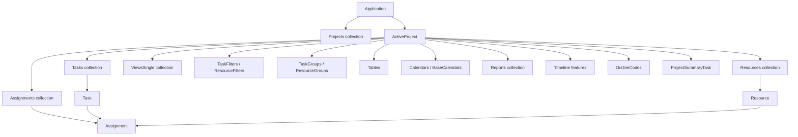

# Microsoft Project VBA Deep Reference

## Executive summary

Microsoft Project’s VBA surface is most useful when you treat it as two layers. The **`Application`** object is the UI/controller layer: it owns app-wide options, active selections, views, editing actions, and file commands. The **`Project`** object is the document/model layer: it owns the open plan and its collections of tasks, resources, assignments, views, calendars, reports, and document properties. The core scheduling entities are **`Task`**, **`Resource`**, and **`Assignment`**; feature areas such as filters, groups, tables, views, reports, timelines, and calendars are also exposed as first-class objects or application methods. citeturn34view0turn34view1turn34view2turn34view3turn34view4turn34view5turn34view6turn34view7turn34view8turn34view9

For an experienced Project user who codes in VBA, the big practical takeaway is this: **prefer object-model edits for schedule data, and use `Application` methods only when you need to automate a UI command or a view-specific operation**. That recommendation is an inference from the way Microsoft documents the model: `Application` is explicitly described as containing methods that act on views, selections, and editing actions, while `Task`, `Resource`, and `Assignment` expose direct project data. That is why robust macros typically read and write objects directly, then use UI methods only for view application, organizer moves, timeline display, leveling, import/export, and dialog-equivalent actions. citeturn34view0turn34view2turn34view3turn34view4

A second practical takeaway is that **Project VBA is very capable for desktop automation, but some enterprise scenarios cross into Project Server / Project Online APIs rather than pure desktop VBA**. Microsoft’s own documentation distinguishes desktop commands such as `FileOpenEx`, `Publish`, SharePoint synchronization, resource engagements, and enterprise actuals protection from broader Project Server / Project Online programmability such as PSI, CSOM, and server-side timesheet objects. In other words: desktop VBA can automate a lot of enterprise-adjacent work, but **portfolio analytics, full timesheet workflows, and deep Project Online server automation are only partially represented in the desktop object model**. citeturn37view0turn16search0turn16search2turn28search0turn28search3turn28search10turn28search16turn28search19

## Object model and feature map

The following diagram reflects the documented hierarchy and the way the major Project VBA objects relate to each other in day-to-day automation. It is a simplification, but it matches the core Microsoft Project VBA references for `Application`, `Project`, `Task`, `Resource`, `Assignment`, views, tables, filters, groups, reports, timelines, calendars, and outline-code/custom-field handling. citeturn34view0turn34view1turn34view2turn34view3turn34view4turn35search3turn34view5turn34view6turn34view7turn34view8turn34view9turn39search0turn9search1turn9search2



### Feature-to-object mapping

| UI feature area | Primary VBA surface | Practical notes | Source |
|---|---|---|---|
| Application shell, active window, selections, app options | `Application` | Microsoft documents `Application` as the whole Project app; it exposes app-wide settings, top-level objects like `ActiveProject`, and methods acting on views, selections, and editing actions. | citeturn34view0 |
| Open project plan / document model | `Project` | `Project` represents one open project in the `Projects` collection and has project-level events such as `Open`, `BeforeSave`, `BeforeClose`, `Calculate`, and `Change`. | citeturn34view1 |
| Tasks | `Project.Tasks`, `Task` | `Task` is the core schedule entity; use `Tasks(index)` or `Tasks.Add`. | citeturn34view2 |
| Resources | `Project.Resources`, `Resource` | `Resource` is the resource master entity; use `Resources(index)` or `Resources.Add`. | citeturn34view3 |
| Assignments | `Task.Assignments`, `Resource.Assignments`, `Assignment` | `Assignment` represents task-resource work allocation and is central to timephased automation. | citeturn34view4turn29search1 |
| Dependencies and link commands | `Task.LinkPredecessors`, `Application.LinkTasks`, `Application.UnlinkTasks` | `LinkPredecessors` gives object-level control; `LinkTasks` / `UnlinkTasks` automate the ribbon command against the current selection. | citeturn36view3turn22search4turn22search1 |
| Constraints, dates, status date | `Task.ConstraintType`, `Task.ConstraintDate`, `Project.StatusDate`, `Application.ChangeStatusDate` | Microsoft explicitly ties certain constraint types to the `ConstraintDate` property and uses `StatusDate` in progress lines and earned value calculations. | citeturn36view4turn36view5turn36view1turn36view2 |
| Baselines | `Application.BaselineSave`, baseline fields | In the reviewed docs, baseline management is exposed primarily via `BaselineSave` / `BaselineClear` and baseline fields rather than a dedicated `Baseline` object. | citeturn36view0turn29search4 |
| Outline and WBS | `Task.OutlineLevel`, `Application.OutlineIndent`, `Application.OutlineOutdent`, `Application.OutlineShowTasks`, `Task.WBS`, `Application.WBSCodeMaskEdit` | Project distinguishes the task outline hierarchy from custom WBS code behavior; both are scriptable. | citeturn9search13turn21search4turn21search1turn9search9turn10search2turn39search1 |
| Custom fields, project fields, enterprise fields | `Application.FieldNameToFieldConstant`, `Task.SetField`, `Resource.SetField`, `ProjectSummaryTask`, `OutlineCodes` | Microsoft documents generic field resolution with `FieldNameToFieldConstant`; enterprise project/resource fields are commonly accessed through `SetField`/`GetField`, and project-level custom fields are exposed through `ProjectSummaryTask`. | citeturn9search2turn9search4turn9search12turn9search16turn24search2turn9search1turn9search3 |
| Views | `Project.ViewsSingle`, `ViewSingle`, `Application.ViewApply`, `ViewsSingle.Add` | Single-pane views are explicit objects with properties for table, filter, group, and type. | citeturn35search5turn35search3turn3search0turn35search8 |
| Filters | `Filter`, `Filters`, `Application.FilterApply` | A filter is a first-class object and can also be applied by application method. | citeturn34view5turn3search2 |
| Groups | `Group`, `TaskGroups`, `ResourceGroups`, `Application.GroupApply` | Groups are first-class definitions for task or resource views. | citeturn34view6turn3search3 |
| Tables | `Table`, `Tables`, `Application.TableApply` | Tables are first-class objects with `TableFields`, menu visibility, and table type. | citeturn34view7turn3search1 |
| Calendars | `Calendar`, `Calendars`, `BaseCalendars` | The `Calendar` object represents a resource or project calendar and is a member of the `Calendars` collection; Microsoft specifically points you to `BaseCalendars(index)` for retrieval. | citeturn39search0 |
| Timeline | Timeline object pages plus `TaskOnTimeline`, `TaskOnTimelineEx`, `TimelineGotoSelectedTask`, `RemoveTimelineBar` | Timeline automation is substantial in modern versions, especially with custom timelines and bar management introduced in Office 2016. | citeturn34view8turn20search0turn40search0turn40search5turn40search1turn40search6 |
| Reports | `Report`, `Reports`, Organizer, Excel export | Reports are their own object family containing shapes, report tables, and charts; macro recording for reports is explicitly **not** implemented. | citeturn34view9turn31search1turn38view1 |
| Ribbon and command bars | `Project.SetCustomUI`, `Application.CommandBars`, `Project.CommandBars` | Modern customization is Ribbon XML via `SetCustomUI`; legacy command bars remain accessible. Microsoft also notes that command bars were superseded in some Office apps by the ribbon. | citeturn39search7turn39search2turn30search6turn30search10 |
| Organizer and global template | `Application.OrganizerMoveItem`, `Global.mpt` | Use the Organizer to copy views, tables, filters, groups, reports, calendars, and maps between projects and `Global.mpt`; `Global.mpt` is formatting/global-customization storage, not schedule data storage. | citeturn31search0turn38view2turn38view3 |

### What is official, what is absent, and what is unspecified

A few important edges of the model are worth calling out explicitly. First, **reports are automatable but not macro-recordable**; Microsoft says the `Report` object exists, but report add/edit steps are not captured by the macro recorder. Second, **custom forms in the old Project sense are not used in current Project**; Microsoft’s `CustomForms` method says exactly that, so practical VBA solutions should use **VBA `UserForm` objects** for dialogs and wizards. Third, exact one-to-one mappings for **every** ribbon button and legacy menu command are **unspecified** in the reviewed sources; where Microsoft documents a Project VBA method for a command, this report maps it, and where it does not, that absence is noted rather than guessed. citeturn34view9turn24search16turn24search13turn24search1turn39search7turn39search2

## Core procedures and coding patterns

### File lifecycle and application bootstrap

Microsoft’s own examples show both **late binding** and **early binding** for automating Project from another Office host, and explicitly say that early binding gives better performance because the type library is loaded at design time. They also make an important event-related point: if you instantiate Project from another host and want application-level events, register handlers **after** `Visible = True`; otherwise child object methods can fail. citeturn34view0

```vb
Option Explicit

' Reference required for early binding:
' Tools > References > Microsoft Project xx.0 Object Library

Public Sub CreateOrOpenPlan()
    Dim pjApp As MSProject.Application
    
    Set pjApp = New MSProject.Application
    pjApp.Visible = True
    
    ' New blank plan
    pjApp.FileNew
    
    ' Seed tasks
    pjApp.ActiveProject.Tasks.Add "Initiation"
    pjApp.ActiveProject.Tasks.Add "Planning"
    
    ' Save native MPP
    pjApp.FileSaveAs Name:="C:\Schedules\Example.mpp", FormatID:="MSProject.mpp"
    
    ' Reopen with explicit file/import API when needed
    pjApp.FileOpenEx Name:="C:\Schedules\Example.mpp", ReadOnly:=False
    
    ' Clean close
    pjApp.FileSave
    pjApp.FileCloseEx Save:=pjSave
    pjApp.Quit
End Sub
```

Use `FileNew`, `FileOpenEx`, `FileSave`, `FileSaveAs`, and `FileCloseEx` for the lifecycle. `FileOpenEx` is the more capable open method because it can also import data, use import maps, open local or enterprise projects, and specify format strings such as MPP, MPT, XLS, CSV, TXT, XML, XPS, and PDF-related save/export formats. `FileSaveAs` likewise supports export and map-driven output, including template-cleaning flags such as `ClearBaseline`, `ClearActuals`, `ClearResourceRates`, and `ClearFixedCosts`. citeturn14search0turn37view0turn14search9turn37view1turn14search6

### Iterating tasks, resources, and assignments safely

The core traversal pattern is straightforward: get the active project, iterate `Tasks`, `Resources`, and `Assignments`, and work against the object model rather than the screen. Microsoft’s object pages are clear that `Task`, `Resource`, and `Assignment` are all collection members reachable by indexed lookup and by collection iteration. citeturn34view2turn34view3turn34view4

```vb
Option Explicit

Public Sub DumpScheduleFacts()
    Dim p As Project
    Dim t As Task
    Dim r As Resource
    Dim a As Assignment
    
    Set p = ActiveProject
    
    Debug.Print "PROJECT:", p.Name
    Debug.Print "TASKS"
    For Each t In p.Tasks
        If Not t Is Nothing Then
            Debug.Print t.ID, t.Name
        End If
    Next t
    
    Debug.Print "RESOURCES"
    For Each r In p.Resources
        If Not r Is Nothing Then
            Debug.Print r.ID, r.Name
        End If
    Next r
    
    Debug.Print "ASSIGNMENTS"
    For Each t In p.Tasks
        If Not t Is Nothing Then
            For Each a In t.Assignments
                If Not a Is Nothing Then
                    Debug.Print t.ID, t.Name, a.ResourceName
                End If
            Next a
        End If
    Next t
End Sub
```

The `If Not ... Is Nothing` guards are a long-standing practical Project VBA convention. Microsoft’s documentation does not make that warning explicit in the pages reviewed here, but the pattern remains prudent in real plans where gaps can exist in the collections after deletions. That is a practical recommendation rather than a direct Microsoft quote.

### Dependencies, constraints, dates, outline, WBS, and status

For direct dependency automation, the cleanest object-level method is `Task.LinkPredecessors`. For selection-driven command automation, use `Application.LinkTasks` and `Application.UnlinkTasks`. For outline control, use `OutlineIndent`, `OutlineOutdent`, and `OutlineShowTasks`; for WBS conventions, use `Task.WBS` plus `WBSCodeMaskEdit`; for status processing and earned-value-sensitive automation, set `Project.StatusDate` or call `ChangeStatusDate`. citeturn36view3turn22search4turn22search1turn21search4turn21search1turn9search9turn10search2turn39search1turn36view1turn36view2

```vb
Option Explicit

Public Sub BuildSimpleNetwork()
    Dim p As Project
    Dim t1 As Task, t2 As Task, t3 As Task
    
    Set p = ActiveProject
    
    Set t1 = p.Tasks.Add("Design")
    Set t2 = p.Tasks.Add("Build")
    Set t3 = p.Tasks.Add("Test")
    
    ' Direct object-model dependency creation
    t2.LinkPredecessors t1, pjFinishToStart
    t3.LinkPredecessors t2, pjFinishToStart
    
    ' Constraint example
    t2.ConstraintType = pjSNET
    t2.ConstraintDate = Date + 7
    
    ' Project progress control
    p.StatusDate = Date
    
    ' Outline / WBS examples
    Application.OutlineIndent
    Application.WBSCodeMaskEdit CodePrefix:="PRJ", Level:=1, _
        Sequence:=pjWBSSequenceNumbers, Length:=2, Separator:="."
End Sub
```

A constraint nuance matters a great deal in practice: Microsoft explicitly documents that if `ConstraintType` is one of `pjFNET`, `pjFNLT`, `pjMFO`, `pjMSO`, `pjSNET`, or `pjSNLT`, Project uses the **constraint date**, so your code should set `ConstraintDate` intentionally rather than assuming the type alone is enough. Likewise, `ChangeStatusDate` is not just cosmetic; Microsoft states that the status date drives progress lines and earned value calculations. citeturn36view4turn36view5turn36view2

### Baselines, timephased data, and custom fields

Baseline automation is more field-centric than object-centric. The reviewed Project VBA docs expose `Application.BaselineSave` and `BaselineClear`, while task and assignment objects expose the broader field families and `TimeScaleData` methods for timephased work. For custom fields, Microsoft’s generic pattern is `FieldNameToFieldConstant` + `SetField` / `GetField`, and project-level custom fields are surfaced through `ProjectSummaryTask`. Outline codes are a specific kind of local custom field with hierarchical lookup behavior. citeturn36view0turn29search1turn29search2turn29search21turn9search2turn9search4turn9search12turn9search16turn9search1turn9search3

```vb
Option Explicit

Public Sub SaveBaselineAndTagPhase()
    Dim fld As Long
    Dim t As Task
    
    ' Save baseline for all tasks
    Call Application.BaselineSave(True)
    
    ' Resolve a custom field generically
    fld = Application.FieldNameToFieldConstant("Text1", pjTask)
    
    For Each t In ActiveProject.Tasks
        If Not t Is Nothing Then
            t.SetField fld, "Phase A"
        End If
    Next t
End Sub
```

```vb
Option Explicit

Public Sub SetProjectMetadata()
    Dim projFld As Long
    
    ' Project-level custom field via ProjectSummaryTask
    projFld = Application.FieldNameToFieldConstant("Cost1", pjTask)
    ActiveProject.ProjectSummaryTask.SetField projFld, "500.00"
End Sub
```

If you work with **enterprise custom fields**, the creation and administration side is not primarily done in Project desktop VBA. Microsoft’s outline-code documentation says enterprise fields with hierarchical lookup tables behave as outline codes, but enterprise-field creation belongs in **Project Web App** or the **Project Server Interface**. citeturn9search1turn9search5

### Views, filters, groups, tables, timeline, reports, calendars, and metadata

Project’s presentation layer is far richer in VBA than many users realize. Use `ViewApply`, `TableApply`, `FilterApply`, and `GroupApply` for ribbon-equivalent view changes. Use the `ViewSingle` family when you want programmable view definitions. Use `TaskOnTimeline` / `TaskOnTimelineEx` and `RemoveTimelineBar` for timeline automation. Use Organizer automation to move views, tables, reports, and related items to other projects or to `Global.mpt`. Use `CustomDocumentProperties` / `BuiltinDocumentProperties` when you need document-level metadata; because the user requested “user properties” and that term is ambiguous in Project, this report interprets it as **custom document properties on the `.mpp` file**, which is the documented Project VBA feature closest to that phrase. If you meant Project Server user accounts or enterprise resource profile properties, that is **unspecified** here. citeturn3search0turn3search1turn3search2turn3search3turn35search3turn35search8turn40search0turn40search5turn40search1turn38view2turn26search0turn25search0turn26search7

```vb
Option Explicit

Public Sub ApplyPresentationLayer()
    ' Equivalent to common view-layer UI commands
    Application.ViewApply Name:="Gantt Chart"
    Application.TableApply Name:="Entry"
    Application.FilterApply Name:="Critical"
    Application.GroupApply Name:="No Group"
    
    ' Put task 3 on the executive timeline bar 0
    Application.TaskOnTimelineEx TaskID:=3, TimelineViewName:="Timeline", BarIndex:=0
End Sub
```

```vb
Option Explicit

Public Sub CopyCustomViewToGlobal()
    ' Make a named view/template element available everywhere
    Application.OrganizerMoveItem _
        Type:=pjViews, _
        FileName:=ActiveProject.FullName, _
        ToFileName:="Global.MPT", _
        Name:="My Executive Gantt", _
        Task:=True
End Sub
```

```vb
Option Explicit

Public Sub StampCustomDocumentProperty()
    ' Requires Microsoft Office Object Library reference
    Dim props As Office.DocumentProperties
    
    Set props = ActiveProject.CustomDocumentProperties
    
    On Error Resume Next
    props("AutomationOwner").Value = Environ$("Username")
    If Err.Number <> 0 Then
        Err.Clear
        props.Add Name:="AutomationOwner", LinkToContent:=False, _
                  Type:=msoPropertyTypeString, Value:=Environ$("Username")
    End If
    On Error GoTo 0
End Sub
```

For calendars, the Project VBA docs identify the `Calendar` object as representing a resource or project calendar and direct you to `BaseCalendars(index)` to retrieve one. For reports, remember the important limitation: the `Report` object exists, but **macro recording is not implemented** for report creation/editing, so plan to code reports deliberately rather than expecting macro recording to discover the API for you. citeturn39search0turn34view9

## UI command and shortcut mappings

### Common ribbon and menu command mappings

| UI command | Direct or closest VBA call | Notes | Source |
|---|---|---|---|
| File > New | `Application.FileNew` | Creates a new project. | citeturn14search0 |
| File > Open | `Application.FileOpenEx` | Opens a project or imports data; supports maps and enterprise paths. | citeturn37view0 |
| File > Save | `Application.FileSave` | Saves the active project. | citeturn14search9 |
| File > Save As / Export | `Application.FileSaveAs` | Native save or export to MPP, MPT, XLS, CSV, TXT, XML, XPS, PDF-related output. | citeturn37view1 |
| File > Properties | `Application.FileProperties` | Opens the project Properties dialog; can be paired with `BuiltinDocumentProperties` / `CustomDocumentProperties`. | citeturn26search7turn26search0turn25search0 |
| File > Organizer | `Application.OrganizerMoveItem` | Programmatic equivalent for moving views, tables, reports, calendars, maps, and related elements. | citeturn31search0turn38view2 |
| Task > Link Selected Tasks | `Application.LinkTasks` | Selection-based UI command equivalent. | citeturn22search4 |
| Task > Unlink Tasks | `Application.UnlinkTasks` | Selection-based UI command equivalent. | citeturn22search1 |
| Task > Indent | `Application.OutlineIndent` | Indents selected task(s). | citeturn21search4 |
| Task > Outdent | `Application.OutlineOutdent` | Promotes selected task(s). | citeturn21search1 |
| View > Filter | `Application.FilterApply` or `Filter.Apply` | Either apply by name at application level or call the filter object directly. | citeturn3search2turn34view5 |
| View > Group By | `Application.GroupApply` | Group definition application. | citeturn3search3 |
| View > Tables | `Application.TableApply` or `Table.Apply` | Table application by name or by object. | citeturn3search1turn34view7 |
| View > Change View | `Application.ViewApply` or `ViewSingle.Apply` | Use `ViewSingle` for defined single-pane views. | citeturn3search0turn35search3 |
| Resource > Level All | `Application.LevelNow True` | Levels overallocated resources. | citeturn36view6 |
| Resource > Leveling Options | `Application.LevelingOptionsEx ...` | Script the options instead of opening the dialog. | citeturn36view7 |
| Timeline > Add/Remove tasks | `Application.TaskOnTimeline`, `Application.TaskOnTimelineEx` | The `Ex` method supports custom timelines and bar indexes. | citeturn40search0turn40search5 |
| Timeline option menu > Go to Selected Task | `Application.TimelineGotoSelectedTask` | Microsoft explicitly says this corresponds to that command. | citeturn20search0 |
| Timeline > Remove bar | `Application.RemoveTimelineBar` | Bar-management API introduced in Office 2016. | citeturn40search1turn40search6 |
| Format / WBS definition | `Application.WBSCodeMaskEdit` | Edits WBS mask definition. | citeturn39search1 |

### Shortcut mappings

The table below is intentionally conservative. It maps only shortcuts that are either directly documented by Microsoft Support for Project, or generically documented for the Office ribbon, and then links them to the closest documented Project VBA call. Where the reviewed sources do **not** show a one-to-one VBA command, the table says so explicitly. citeturn33view0turn33view1

| Shortcut | UI effect | Documented VBA mapping | Notes | Source |
|---|---|---|---|---|
| `Ctrl+C` | Copy selected data | `Application.EditCopy` | Direct ribbon/menu equivalent. | citeturn21search2turn33view0 |
| `Ctrl+V` | Paste into active selection | `Application.EditPaste` | Direct ribbon/menu equivalent. | citeturn22search3turn33view0 |
| `Alt` | Show ribbon KeyTips | No one-line Project data API; customize via `Project.SetCustomUI` or legacy `CommandBars` | This is ribbon navigation, not schedule edit automation. | citeturn33view1turn39search7turn39search2 |
| `Alt+F` | Open File page | Closest schedule-side calls are `FileNew`, `FileOpenEx`, `FileSaveAs`, `FileProperties` | The shortcut opens Backstage; use file methods for automation. | citeturn33view1turn14search0turn37view0turn37view1turn26search7 |
| `Alt+H` | Open Home tab | No documented one-to-one VBA command | Use object-model or specific application methods instead. | citeturn33view1 |
| `Alt+R` | Open Review tab | No documented one-to-one VBA command in reviewed sources | Unspecified for this report. | citeturn33view1 |
| `Alt+W` | Open View tab | Closest direct methods: `ViewApply`, `TableApply`, `FilterApply`, `GroupApply` | Useful mental mapping for view automation. | citeturn33view1turn3search0turn3search1turn3search2turn3search3 |
| `Shift+F2` | Show task/resource/assignment information dialog | No direct one-to-one method found in reviewed Project VBA sources | Use object properties programmatically instead of dialog automation. | citeturn33view0turn34view2turn34view3turn34view4 |
| `F6` | Move among panes / ribbon / status bar | No direct one-to-one scheduling API | For timeline-specific “go to selected task,” use `TimelineGotoSelectedTask`. | citeturn33view0turn33view1turn20search0 |
| `Ctrl+F9` | Toggle Auto Calculate | No verified one-to-one call in the reviewed sources | Treat as a UI state unless you verify the exact property in your object browser. | citeturn33view0 |
| `Alt+Arrow keys` in Print window | Move preview pane | No direct one-to-one scheduling API | Preview navigation only. | citeturn33view0 |

## Automation scenarios and end-to-end examples

### Desktop schedule build from Excel backlog

Project can import task, resource, and assignment data from Excel, CSV, TXT, XML, and other formats, either interactively through maps or programmatically with `FileOpenEx` and `FileSaveAs`. Microsoft Support also documents the Export/Import Wizard behavior and the ability to save maps and move them into `Global.mpt` with the Organizer. If your source is already shaped well, native maps are the fastest path; if not, direct Excel automation often gives you more control. citeturn37view0turn37view1turn38view0turn38view1turn31search0

```vb
Option Explicit

Public Sub ImportBacklogFromExcel()
    ' Early-bound Excel reference recommended; late binding shown for portability.
    Dim xlApp As Object
    Dim wb As Object, ws As Object
    Dim rowNum As Long
    Dim t As Task
    
    Set xlApp = CreateObject("Excel.Application")
    xlApp.Visible = False
    
    Set wb = xlApp.Workbooks.Open("C:\Data\backlog.xlsx")
    Set ws = wb.Worksheets("Tasks")
    
    rowNum = 2
    Do While Len(ws.Cells(rowNum, 1).Value) > 0
        Set t = ActiveProject.Tasks.Add(CStr(ws.Cells(rowNum, 1).Value))
        
        ' Example source columns:
        ' A = Task Name
        ' B = Duration text such as 5d
        ' C = Start date
        t.Duration = CStr(ws.Cells(rowNum, 2).Value)
        t.Start = CDate(ws.Cells(rowNum, 3).Value)
        
        rowNum = rowNum + 1
    Loop
    
    wb.Close False
    xlApp.Quit
End Sub
```

For **high-volume recurring imports**, prefer a stable source schema and a saved import map when the transformation rules are simple, because that keeps non-code admins involved. Prefer direct Excel automation when you need row-level business logic, validation, deduplication, or custom dependency synthesis. That is a practical engineering recommendation grounded in Microsoft’s import/export-map model. citeturn38view0turn38view1

### Scheduling and resource leveling workflow

Project’s leveling surface is better than many macros use. Instead of just calling `LevelNow`, script the options first with `LevelingOptionsEx`, then level. That makes your macro reproducible and avoids “it looked different on my machine” schedule drift. citeturn36view6turn36view7


```vb
Option Explicit

Public Sub NormalizeThenLevel()
    With Application
        .ChangeStatusDate Date
        
        .LevelingOptionsEx _
            Automatic:=False, _
            DelayInSlack:=False, _
            AutoClearLeveling:=True, _
            Order:=pjLevelOrderStandard, _
            LevelEntireProject:=True, _
            LevelIndividualAssignments:=True, _
            LevelingCanSplit:=True, _
            LevelProposedBookings:=False, _
            LevelPinnedTasks:=False
        
        .LevelNow True
    End With
End Sub
```

If your organization relies on manually scheduled tasks, note Microsoft’s point that `LevelingOptionsEx` adds explicit control for leveling manually scheduled tasks as well. That is one of the reasons it is generally preferable to the older leveling-options surface for modern Project clients. citeturn36view7

### Reporting pipeline to Excel and Outlook

Project desktop has built-in reports, but Microsoft also recommends Excel as the destination for richer visual analysis. Programmatically, there are two common patterns: **native export** through `FileSaveAs`/maps, or **object-model extraction** into Excel, followed by Outlook automation for distribution. Microsoft documents all three pieces: Project export formats and maps, Excel automation via `CreateObject`, and Outlook `CreateItem` / `MailItem`. citeturn37view1turn38view1turn15search1turn15search3turn15search2turn15search4turn15search0

```vb
Option Explicit

Public Sub SendWeeklyStatusMail()
    Dim xlApp As Object, wb As Object, ws As Object
    Dim olApp As Object, mail As Object
    Dim t As Task, r As Long
    Dim outPath As String
    
    outPath = Environ$("TEMP") & "\WeeklyStatus.xlsx"
    
    Set xlApp = CreateObject("Excel.Application")
    Set wb = xlApp.Workbooks.Add
    Set ws = wb.Worksheets(1)
    
    ws.Cells(1, 1).Value = "ID"
    ws.Cells(1, 2).Value = "Task"
    ws.Cells(1, 3).Value = "% Complete"
    ws.Cells(1, 4).Value = "Start"
    ws.Cells(1, 5).Value = "Finish"
    
    r = 2
    For Each t In ActiveProject.Tasks
        If Not t Is Nothing Then
            If Not t.Summary Then
                ws.Cells(r, 1).Value = t.ID
                ws.Cells(r, 2).Value = t.Name
                ws.Cells(r, 3).Value = t.PercentComplete
                ws.Cells(r, 4).Value = t.Start
                ws.Cells(r, 5).Value = t.Finish
                r = r + 1
            End If
        End If
    Next t
    
    wb.SaveAs outPath
    wb.Close False
    xlApp.Quit
    
    Set olApp = CreateObject("Outlook.Application")
    Set mail = olApp.CreateItem(0) ' olMailItem
    
    With mail
        .To = "pm-team@example.com"
        .Subject = "Weekly Project Status - " & ActiveProject.Name
        .Body = "Attached is the latest weekly status extract."
        .Attachments.Add outPath
        .Display   ' use .Send when appropriate
    End With
End Sub
```

For native report objects, remember the limitation from the Microsoft docs: **report creation/edit editing is not macro-recordable**. In practice, that means Excel-based reporting is often easier to maintain for code-first teams, even when the built-in Project reports are useful for ad hoc human consumption. citeturn34view9turn38view1

### Status updates, timesheet-like imports, SharePoint sync, and portfolio loops

For ordinary desktop plans, the common “timesheet import” pattern is to treat an external time system as the source of actuals and then update task/assignment progress, anchored by a meaningful `StatusDate`. Microsoft’s documentation also confirms that enterprise actuals can be protected after timesheet acceptance, and that enterprise actuals can be synchronized from the timesheet system. That matters because the exact fields you are allowed to push can differ between local plans and enterprise plans. citeturn36view1turn28search0turn28search3

```vb
Option Explicit

Public Sub ApplySimpleStatusByWBS(ByVal statusDateValue As Date)
    Dim t As Task
    
    ActiveProject.StatusDate = statusDateValue
    
    ' Example business rule:
    ' mark all tasks starting before status date as 100% if already finished
    For Each t In ActiveProject.Tasks
        If Not t Is Nothing Then
            If Not t.Summary Then
                If t.Finish <= statusDateValue Then
                    t.PercentComplete = 100
                End If
            End If
        End If
    Next t
End Sub
```

For SharePoint-linked scenarios, Project Professional exposes desktop methods such as `OpenFromSharePoint` and `SynchronizeWithSite`. Microsoft is explicit that SharePoint task-list synchronization is designed for users who are **not** using Project Server as the primary enterprise store, and that saving a local project to a SharePoint site is a sharing mechanism for people who do not have Project Web App access. citeturn16search2turn16search0

```vb
Option Explicit

Public Sub OpenSharePointTaskList()
    Application.OpenFromSharePoint _
        SiteURL:="https://ServerName/PWA/Simple", _
        ListName:="TestTasks"
End Sub

Public Sub PushBackToSharePoint()
    Application.SynchronizeWithSite
End Sub
```

For **enterprise portfolio loops**, use `FileOpenEx` with the enterprise path syntax (`<>\ProjectName`) and publish through the draft/published-database flow. Microsoft’s `FileOpenEx` remarks explicitly say enterprise opens come from the **Draft** database and that you should use `Application.Publish` to push changes into the **Published** database. If your use case is broader than opening and publishing projects—especially cross-project portfolio analytics, timesheet management, or Project Online data extraction—Microsoft’s guidance points you toward Project Server / Project Online programmability such as PSI, CSOM, and export-data definitions rather than pure desktop VBA. citeturn37view0turn28search10turn28search16turn28search1turn28search19

## Best practices, performance, security, and deployment

### Engineering guidance

| Topic | Practical recommendation | Why it matters | Source |
|---|---|---|---|
| Binding strategy | Use **early binding** during development; consider late binding only for optional secondary Office apps or version-flexibility edges. | Microsoft explicitly says early binding performs better and gives design-time type-library loading and IntelliSense; late binding is slower and lacks IntelliSense. | citeturn34view0turn19search1turn19search9 |
| Event bootstrap | If automating Project from another host, set `Visible = True` **before** registering application events. | Microsoft documents child-object failures if app-level events are registered too early. | citeturn34view0 |
| Object-first design | Prefer `Task` / `Resource` / `Assignment` edits over selection-driven macros whenever possible. | Inference from object-model structure: `Application` is oriented toward views/selections/editing actions, while entity objects expose direct data. | citeturn34view0turn34view2turn34view3turn34view4 |
| Reusable UI assets | Store reusable views, tables, filters, groups, reports, and calendars in `Global.mpt` or a controlled template; use Organizer automation to distribute them. | Microsoft documents the Organizer and `Global.mpt` specifically for these elements. | citeturn31search0turn38view2turn38view3 |
| Data starter kits | Use `.mpt` project templates, not `Global.mpt`, for starter tasks/resources/assignments or custom value-list payloads. | Microsoft says `Global.mpt` cannot store tasks/resources/assignments and value-list lookup content is not stored there. | citeturn38view2turn38view3 |
| Reports | Use built-in reports for user-facing dashboards; use Excel export/object extraction for code-first reporting. | Report object exists, but report add/edit actions are not macro-recorded; Excel is Microsoft’s recommended rich-analysis destination. | citeturn34view9turn38view1 |
| Import/export design | Normalize map names, version-control your map assumptions, and move maps to `Global.mpt` only when they are stable. | Microsoft documents saved maps and Organizer-based reuse. | citeturn38view0turn31search0 |

### Trust Center, macro security, and code signing

Office macro security is materially stricter than it used to be. Microsoft states that **macros from the internet are blocked by default in Office**, and the current security recommendation for users who truly need macros is generally **disable all except digitally signed macros** and require trusted publishers. For testing or internal development, you can sign a VBA project with a certificate; Microsoft’s support article also notes the `SelfCert.exe` path for local testing. citeturn17search0turn17search1turn17search16

If your solution modifies VBA projects programmatically or inspects VB components, Microsoft also warns that **“Trust access to the VBA project object model”** is a security hazard and should ideally be enabled only for the duration needed. That guidance matters for any deployment pattern that self-installs modules, self-updates code, or manipulates VBProjects through the extensibility library. citeturn18search1

A practical enterprise deployment posture for Project VBA is therefore:

- sign production macro projects with an organizational code-signing certificate;
- distribute the signer as a **Trusted Publisher**;
- keep macro-enabled files in controlled trusted locations only when necessary;
- avoid “Enable all macros” except in isolated test environments. citeturn17search0turn17search1turn17search12turn17search18

Microsoft has also published guidance about upgrading signed VBA projects to the newer **V3** signature format; if you maintain older signed templates or global files, re-signing them with the current VBA editor flow is a sensible maintenance step. citeturn17search4

### References, compatibility, and 32-bit / 64-bit concerns

For external Office automation, add only the references you truly need. Use the Project object library for strong typing, and add the Office object library only when you need metadata types such as `DocumentProperties`. Microsoft’s Project document-property pages explicitly say the Office object library reference is required to manipulate those properties. citeturn25search0turn26search0

If your code uses Windows API declares, Microsoft’s VBA guidance is explicit: in 64-bit Office, `Declare` statements must be `PtrSafe`, pointer/handle values must use `LongPtr`, and 64-bit integrals may need `LongLong`. The compiler constants `VBA7` and `Win64` are the standard compatibility guards. citeturn19search2turn19search6turn19search7turn19search16turn19search10

A skeleton compatibility pattern:

```vb
#If VBA7 Then
    Private Declare PtrSafe Function SomeApi Lib "..." (ByVal h As LongPtr) As LongPtr
#Else
    Private Declare Function SomeApi Lib "..." (ByVal h As Long) As Long
#End If
```

## Suggested module and class organization

A Project VBA solution is still a classic VBA project: a collection of modules, class modules, and user forms embedded in the host file. Microsoft’s VBA file-format and glossary documentation describe VBA projects in exactly those terms, and the Project/Office references support modules plus user forms as the practical host-side architecture. citeturn24search4turn5search9turn24search1turn24search13

A maintainable organization for a serious Project automation package usually looks like this:

```text
VBAProject
├─ ThisProject / ThisDocument
│  └─ bootstrap, event wiring, startup checks
├─ basEntryPoints
│  └─ user-facing macros only
├─ basProjectIO
│  └─ FileNew/FileOpenEx/FileSaveAs/FileCloseEx, templates, Organizer
├─ basScheduling
│  └─ task creation, links, constraints, milestones, WBS, outline
├─ basResources
│  └─ resource creation, assignments, leveling, calendars
├─ basStatus
│  └─ status date, actuals, percent complete, baseline operations
├─ basViewsAndReports
│  └─ views, filters, tables, groups, timeline, reports
├─ basInteropExcel
│  └─ imports, exports, report workbooks
├─ basInteropOutlook
│  └─ email packaging and distribution
├─ basInteropSharePoint
│  └─ OpenFromSharePoint, SynchronizeWithSite, site-related helpers
├─ basUtilities
│  └─ error handling, logging, field resolution, constants, date helpers
├─ clsAppEvents
│  └─ WithEvents Application sink
├─ clsProjectRules
│  └─ validation and policy rules
├─ frmImportWizard
│  └─ user-driven import options
└─ frmStatusPost
   └─ exception handling / status-post UI
```

That structure keeps the top-level macros small, separates UI from business logic, and puts cross-application dependencies in isolated modules. It also makes export/import of source files (`.bas`, `.cls`, `.frm`) more manageable for source control, review, signing, and release packaging. For reusable view/report/calendar assets, pair the code organization with a deployment strategy based on **templates** and **Organizer moves** into `Global.mpt` only for the elements `Global.mpt` is designed to hold. citeturn31search0turn38view2turn38view3turn24search4

## Open questions and limitations

A few details remain deliberately conservative because the official sources reviewed here do not pin them down fully.

The exact **shortcut-to-command mapping for every built-in Project ribbon button** is not exhaustively documented in the reviewed Microsoft pages. This report therefore maps the commands that have clear Project VBA equivalents and marks the rest as having no verified one-to-one method in the reviewed sources. Ribbon customization itself is documented through `SetCustomUI`, while legacy controls remain on `CommandBars`, but an exhaustive built-in command catalog is **unspecified** here. citeturn39search7turn39search2turn30search10

Likewise, the user request asked for **“Baseline”** as a feature area. In the reviewed Project VBA reference, baseline handling appears primarily as **methods and fields** (`BaselineSave`, baseline field families, timephased baseline values), not as a clean standalone `Baseline` object page. That is why this report treats baseline work as a procedural/field-oriented area rather than a separate object family. citeturn36view0turn37view1

Finally, **timesheets, portfolio automation, and some Project Online / Project Server workflows are only partially exposed in desktop Project VBA**. Microsoft’s own documentation points deeper timesheet and server integration toward PSI, CSOM, server libraries, and export-data definitions. Where this report proposes desktop-compatible “timesheet-like” status imports, those are practical approximations for experienced VBA users, not a claim that the full Project Online timesheet system is represented in the desktop VBA object model. citeturn28search10turn28search16turn28search1turn28search9turn28search19